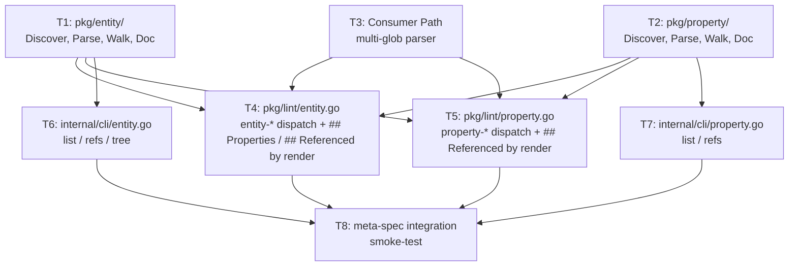

# Plan: Entity and Property CLI Support

**Status:** approved
**Features:**
  - [cli/entity](../../features/cli/entity/README.md)
  - [cli/property](../../features/cli/property/README.md)
  - [cli/spec/lint](../../features/cli/spec/lint/README.md)
**Source type:** feature
**Source:** [cli/entity](../../features/cli/entity/README.md), [cli/property](../../features/cli/property/README.md), [cli/spec/lint](../../features/cli/spec/lint/README.md)
**Author:** alexander.trakhimenok
**Approver:** alexander.trakhimenok
**Created:** 2026-05-18
**Approved:** 2026-05-18
**Effort:** L
**Impact:** high

## Context

The [entity-and-property-cli-support Idea](../../ideas/entity-and-property-cli-support.md) and three CLI feature specifications ([cli/entity](../../features/cli/entity/README.md), [cli/property](../../features/cli/property/README.md), and additions to [cli/spec/lint](../../features/cli/spec/lint/README.md)) are reviewer-approved and lint-clean. This plan delivers the implementation: two new domain packages (`pkg/entity/`, `pkg/property/`), two new dispatch lint checkers (`pkg/lint/entity.go`, `pkg/lint/property.go`), a comma-separated `Consumer Path` parser, two cobra subcommand groups (`internal/cli/entity.go`, `internal/cli/property.go`), and an end-to-end integration smoke test against the meta-spec repository.

The work mirrors the lifecycle-verbs-implementation plan's subagent-driven parallelism but at a larger scope — three concurrent windows instead of two, eight tasks instead of five. Foundation tasks (T1 `pkg/entity/`, T2 `pkg/property/`, T3 Consumer Path parser) are independent and form Window 1. Consumer tasks split into two parallel families: lint enforcement + managed-section rendering (T4 entity dispatch checker, T5 property dispatch checker) and CLI navigation verbs (T6 `internal/cli/entity.go`, T7 `internal/cli/property.go`); all four run in parallel during Window 2 after T1+T2 land. T8 — the meta-spec integration smoke test — is the final acceptance gate.

The Feature READMEs are the authoritative contract. Every `#### REQ:` and `### AC:` in the three approved Features maps to test coverage. No implementation work begins on a task until the source REQs the task satisfies are read end-to-end. Per the Idea, the upstream meta-spec [entity](https://github.com/specscore/specscore/blob/main/spec/features/entity/README.md), [property](https://github.com/specscore/specscore/blob/main/spec/features/property/README.md), and [document-types-registry](https://github.com/specscore/specscore/blob/main/spec/features/document-types-registry/README.md) Features define the meaning of the Doc-Kinds and the multi-glob `Consumer Path` form; the CLI Features define how this repo's code enforces them.

## Acceptance criteria

- Both new CLI command groups (`specscore entity list|refs|tree` and `specscore property list|refs`) are runnable end-to-end against a real spec tree.
- `pkg/entity/` exists exposing `Discover(specRoot string) ([]Discovered, error)`, `Parse(path string) (*Doc, error)`, `Walk(specRoot string, fn func(*Doc) error) error`, plus the `Doc` value type with its parsed fields (per Task 1 API sketch). Used by `pkg/lint/entity.go` and `internal/cli/entity.go`.
- `pkg/property/` exists with the analogous surface (per Task 2 API sketch). Used by `pkg/lint/property.go` and `internal/cli/property.go`.
- `pkg/lint/entity.go` exists implementing the `entityChecker` dispatch checker (parity with `pkg/lint/idea.go`'s `ideaChecker`). Every `entity-*` rule from [cli/entity#lint-enforcement](../../features/cli/entity/README.md#lint-enforcement) is registered with `allRuleNames`, dispatchable via `--rules entity-*`, and exercised by Go-level unit tests.
- `pkg/lint/property.go` exists with the analogous shape for `property-*` rules per [cli/property#lint-enforcement](../../features/cli/property/README.md#lint-enforcement).
- The managed-section rewriter rewrites every entity's `## Properties` and `## Referenced by` and every property's `## Referenced by` under `spec lint --fix`, deterministically and idempotently, satisfying [cli/entity#req:properties-table-rendered](../../features/cli/entity/README.md#req-properties-table-rendered), [cli/entity#req:referenced-by-from-inheritance](../../features/cli/entity/README.md#req-referenced-by-from-inheritance), [cli/entity#req:referenced-by-no-references-fallback](../../features/cli/entity/README.md#req-referenced-by-no-references-fallback), [cli/entity#req:managed-section-fix-is-idempotent](../../features/cli/entity/README.md#req-managed-section-fix-is-idempotent), [cli/entity#req:fix-write-ordering](../../features/cli/entity/README.md#req-fix-write-ordering), [cli/property#req:referenced-by-from-entities](../../features/cli/property/README.md#req-referenced-by-from-entities), [cli/property#req:referenced-by-no-references-fallback](../../features/cli/property/README.md#req-referenced-by-no-references-fallback), [cli/property#req:managed-section-fix-is-idempotent](../../features/cli/property/README.md#req-managed-section-fix-is-idempotent), and [cli/spec/lint#req:managed-section-rewrite-on-fix](../../features/cli/spec/lint/README.md#req-managed-section-rewrite-on-fix).
- The `*.entity.md` and `*.property.md` consumer paths are registered in `pkg/lint/adherence_footer.go`'s `docTypeTargets` map with URLs `https://specscore.md/entity-specification` and `https://specscore.md/property-specification`, satisfying [cli/entity#req:adherence-footer-target-registered](../../features/cli/entity/README.md#req-adherence-footer-target-registered) and [cli/property#req:adherence-footer-target-registered](../../features/cli/property/README.md#req-adherence-footer-target-registered).
- The Consumer Path parser tolerates the comma-separated form per [cli/spec/lint#req:consumer-path-multi-glob](../../features/cli/spec/lint/README.md#req-consumer-path-multi-glob) and [AC: consumer-path-multi-glob-parsed](../../features/cli/spec/lint/README.md#ac-consumer-path-multi-glob-parsed).
- Every `### AC:` block in [cli/entity](../../features/cli/entity/README.md), [cli/property](../../features/cli/property/README.md), and the new ACs in [cli/spec/lint](../../features/cli/spec/lint/README.md) (`entity-and-property-rules-selectable`, `managed-section-fix-idempotent`, `consumer-path-multi-glob-parsed`) is covered by at least one Go unit test (`*_test.go`) that exercises the surface against a tmp-dir spec tree fixture. All tests pass.
- `specscore spec lint --project <meta-spec checkout>` returns `0 violations found` against `github.com/specscore/specscore` at HEAD; `specscore entity list` surfaces the meta-spec's `user` fixture; `specscore property list` surfaces the meta-spec's `email` fixture. (T8 integration test.)
- The build (`go build ./...`) and full test suite (`go test ./...`) pass on the implementer's branch before merging.
- Existing CLI features (`feature list/info/tree/deps/refs/new/change-status`, `idea new/change-status`, `spec lint`, `init`, etc.) and existing lint rules are unchanged in behavior. No regression.
- Out of scope per the source Idea: the feature-level `**Consumes:**` / `**Produces:**` back-reference source (a separate Idea); cross-repo `@import` for entity/property `ref:`; override semantics for inherited properties; lifecycle verbs for entity/property; code generation from entities; an `entity diff` / `entity validate` / `entity graph` verb; i18n in `singular`/`plural`/`description`; promotion of `pkg/yamlfront/` (defer until a second non-trivial caller exists); plugin (`ai-plugin-specscore`) skill files (separate follow-on Idea or docs-only PR).

## Dependency graph



**Parallelism windows:**

- **Window 1** (foundations): T1, T2, T3 in parallel. Each is small, focused, independent. T1 and T2 are sibling parser packages; T3 is the comma-separated `Consumer Path` parser in `pkg/lint/registry.go`. ~1–2 hours each.
- **Window 2** (consumers): T4, T5, T6, T7 in parallel. T4 and T5 depend on T1+T2+T3; T6 depends on T1; T7 depends on T2. T4 owns `pkg/lint/entity.go` + the `## Properties` / entity-`## Referenced by` renderer; T5 owns `pkg/lint/property.go` + the property-`## Referenced by` renderer; T6 and T7 own their respective `internal/cli/*.go` files. No file overlap between the four. ~2–3 hours each.
- **Window 3** (integration): T8 runs alone. ~1 hour (the meta-spec clone dominates).

**Subagent dispatch strategy (recommended):**

The implementing session opens a single message dispatching Agent A (T1), Agent B (T2), and Agent C (T3) in parallel. When all three return success, the session opens a single message dispatching Agent D (T4), Agent E (T5), Agent F (T6), and Agent G (T7) in parallel. When all four return success, the session dispatches Agent H (T8). Total wall-clock: 3 windows ≈ 5–7 hours assuming no surprises.

## Tasks

### 1. Build `pkg/entity/`: Discover, Parse, Walk for `*.entity.md`

Create `pkg/entity/` mirroring the `pkg/idea/` package shape (`Discover`, `Parse`, `Walk`, plus typed helpers). This package is the lowest layer for entity files — the lint dispatch checker and the `internal/cli/entity.go` verbs both depend on it. YAML frontmatter parsing uses `gopkg.in/yaml.v3` (already in the tree per `pkg/projectdef/projectdef.go`). The Idea names this convergence point explicitly under "Should-be-true assumptions" — `Discover`, `Parse`, `Walk` signatures MUST stay kind-agnostic so a hypothetical `pkg/recordset/` can reuse them.

Suggested public API:

```go
package entity

// Discovered is a summary of an entity file found during a Discover walk.
type Discovered struct {
    Slug string // filename stem without ".entity.md"
    Path string // absolute path to the .entity.md file
}

// Doc is a parsed entity file. The struct is intentionally permissive —
// Parse returns a partial Doc even when the file is malformed, so lint
// rules can report every issue they find rather than bailing on the first.
type Doc struct {
    Path        string                  // absolute path
    Slug        string                  // from filename
    RawLines    []string                // body lines for managed-section rewriting
    Title       string                  // full `# Entity: ...` title line, "" if absent
    TitleName   string                  // the `<singular>` portion after "Entity: "
    TitleLine   int                     // 1-based line number of the title
    HasTitle    bool
    Frontmatter *Frontmatter            // nil when frontmatter is absent or unparseable
    FmRaw       *yaml.Node              // round-trippable node for --fix mutations
    Sections    []Section               // every ## section discovered
    SectionByTitle map[string]*Section
    Properties  []PropertyItem          // parsed from frontmatter.properties (inline + ref:)
}

// Frontmatter mirrors the typed fields from the meta-spec
// [entity#req:frontmatter-required-fields].
type Frontmatter struct {
    Kind        string                  // MUST equal "entity"
    ID          string                  // MUST equal Doc.Slug
    Singular    string
    Plural      string
    Description string
    Inherits    string                  // optional path or URL; "" when absent
    Properties  []PropertyItem
}

// PropertyItem is a single entry in the entity's frontmatter `properties`
// list. Exactly one of (DataType, Ref) is non-empty in a valid item.
type PropertyItem struct {
    Name        string                  // required
    DataType    string                  // inline form
    Ref         string                  // reference form (path or URL)
    Description string
    Checks      map[string]any          // free-form per [property#req:checks-shape]
}

// Section reuses the same shape as pkg/idea.Section so lint rules that
// scan sections by name (## Description, ## Properties, ## Referenced by)
// can share the helper code.
type Section struct {
    Title     string
    StartLine int
    EndLine   int
    Body      string
    Items     []string
}

// Discover walks <specRoot>/features/**/*.entity.md and returns every
// discovered entity. Hidden directories (path segment starting with ".")
// and reserved underscore-prefixed directories (e.g. "_tests") MUST be
// skipped — same convention used by walkMatchingFiles in
// pkg/lint/adherence_footer.go and by the property [REQ: discovery-scope].
func Discover(specRoot string) ([]Discovered, error)

// Parse reads the file at `path` and returns a Doc. Parse is resilient:
// the returned Doc is partial when frontmatter is missing/malformed.
// The caller (lint) decides which issues are violations.
func Parse(path string) (*Doc, error)

// Walk is a convenience wrapper: Discover + Parse + apply fn.
// Returns the first error from fn; nil otherwise.
func Walk(specRoot string, fn func(*Doc) error) error

// ValidateSlug returns nil if slug matches `[a-z0-9]+(-[a-z0-9]+)*`.
// Mirrors pkg/idea.ValidateSlug so the two checkers share semantics.
func ValidateSlug(slug string) error

// ResolveRef takes a property item's `ref:` value (relative path or URL)
// and returns the absolute path of the referenced .property.md file, plus
// a boolean indicating whether the path was resolved within specRoot.
// URLs return ("", false, nil) — caller decides whether to flag the URL form
// as a broken reference (today: no, per [entity#req:ref-target-exists]
// which permits the URL form when cross-repo imports land).
func ResolveRef(specRoot, entityPath, ref string) (resolvedPath string, isLocal bool, err error)

// ResolveInherits takes a frontmatter `inherits:` value and returns the
// absolute path of the referenced .entity.md file. Mirrors ResolveRef's
// URL handling for cross-repo support.
func ResolveInherits(specRoot, entityPath, inherits string) (resolvedPath string, isLocal bool, err error)
```

Internal helpers MAY include `parseFrontmatter`, `extractManagedBody`, and `splitTrailingFrontmatterFromBody`. The managed-section marker regex MUST match the canonical `<!-- managed-by: specscore lint --fix -->` / `<!-- end-managed -->` form used elsewhere in the tree (e.g., `pkg/lint/idea_index.go`).

**Tests first.** Write `pkg/entity/discover_test.go`, `pkg/entity/parse_test.go`, `pkg/entity/walk_test.go` BEFORE the implementation, drawing fixtures from the meta-spec failure-mode catalogue at [`spec/features/entity/_tests/`](https://github.com/specscore/specscore/tree/main/spec/features/entity/_tests). Suggested fixture files under `pkg/entity/_testdata/`:

- `valid-minimal.entity.md` — frontmatter with the five required keys, empty properties list, every required section.
- `valid-with-inherits.entity.md` — frontmatter declares `inherits: ./parent.entity.md`.
- `valid-with-ref-property.entity.md` — `properties[].ref:` pointing at a sibling `.property.md`.
- `missing-frontmatter.entity.md` — body only, no `---` delimiters.
- `frontmatter-missing-required-fields.entity.md` — `kind: entity` but no `id`.
- `duplicate-property-name.entity.md` — two `properties[]` entries with `name: email`.
- `id-mismatch-slug.entity.md` — frontmatter `id: usr`, filename `user.entity.md`.
- `title-mismatch-singular.entity.md` — frontmatter `singular: User`, title `# Entity: Person`.

**Depends on:** (none)

**Produces:**
- `pkg/entity/discover.go`, `pkg/entity/parse.go`, `pkg/entity/walk.go`, `pkg/entity/refs.go` (or one combined `pkg/entity/entity.go`; implementer's choice — match the existing `pkg/idea/` file split).
- `pkg/entity/discover_test.go`, `pkg/entity/parse_test.go`, `pkg/entity/walk_test.go`, `pkg/entity/refs_test.go`.
- `pkg/entity/_testdata/*.entity.md` and supporting `.property.md` siblings.

**Acceptance criteria:**
- `go test ./pkg/entity/...` passes.
- `Discover`, `Parse`, `Walk`, `ValidateSlug`, `ResolveRef`, `ResolveInherits`, `Doc`, `Frontmatter`, `PropertyItem`, `Section` are exported with stable signatures.
- `Discover` skips hidden directories (path segment starting with `.`) and underscore-prefixed directories (e.g., `_tests`) per [cli/entity#req:discovery-scope](../../features/cli/entity/README.md#req-discovery-scope).
- `Parse` returns a non-nil Doc for every fixture even when frontmatter is missing or malformed (resilient parsing).
- `Parse` preserves `RawLines` byte-for-byte so the managed-section rewriter (T4) can rewrite specific line ranges without losing other content.
- `Parse` populates `FmRaw` as a `yaml.Node` so the `id`-rewrite autofix can round-trip the frontmatter without losing comments or key order, satisfying the Idea's Must-be-true assumption on YAML round-trip.
- No imports from `internal/cli/` or `pkg/lint/` — `pkg/entity/` is a leaf package depending only on the standard library and `gopkg.in/yaml.v3`.

### 2. Build `pkg/property/`: Discover, Parse, Walk for `*.property.md`

Create `pkg/property/` as the sibling of `pkg/entity/`. The signatures and discipline are identical; the differences are in the Doc-Kind-specific frontmatter shape (`data_type`, `checks` mapping instead of `properties` list) and the absence of an inheritance graph.

Suggested public API:

```go
package property

type Discovered struct {
    Slug string
    Path string
}

type Doc struct {
    Path        string
    Slug        string
    RawLines    []string
    Title       string        // full `# Property: ...` title line
    TitleName   string        // the `<id>` portion after "Property: "
    TitleLine   int
    HasTitle    bool
    Frontmatter *Frontmatter
    FmRaw       *yaml.Node
    Sections    []Section
    SectionByTitle map[string]*Section
}

// Frontmatter mirrors [property#req:frontmatter-required-fields].
type Frontmatter struct {
    Kind        string         // MUST equal "property"
    ID          string         // MUST equal Doc.Slug
    DataType    string         // one of [property#req:data-type-values]
    Description string
    Checks      map[string]any
}

type Section struct {
    Title     string
    StartLine int
    EndLine   int
    Body      string
    Items     []string
}

// LegalDataTypes mirrors the upstream enumeration in
// [property#req:data-type-values].
var LegalDataTypes = map[string]bool{
    "string":   true,
    "integer":  true,
    "number":   true,
    "boolean":  true,
    "date":     true,
    "datetime": true,
    "object":   true,
    "array":    true,
    "ref":      true,
}

// CheckKeyApplicability returns the set of data types each check key
// applies to per [property#req:checks-shape] — used by
// `property-checks-shape` to validate the (data_type, check) pair.
//
// Keys NOT present in this map are "unknown keys" — reported at
// severity `warning` per [cli/property#req:checks-shape-applicability].
var CheckKeyApplicability = map[string]map[string]bool{
    "required":   {"string": true, "integer": true, "number": true, "boolean": true, "date": true, "datetime": true, "object": true, "array": true, "ref": true},
    "enum":       {"string": true, "integer": true, "number": true, "boolean": true, "date": true, "datetime": true, "object": true, "array": true, "ref": true},
    "min":        {"integer": true, "number": true, "date": true, "datetime": true},
    "max":        {"integer": true, "number": true, "date": true, "datetime": true},
    "min_length": {"string": true, "array": true},
    "max_length": {"string": true, "array": true},
    "pattern":    {"string": true},
    "trim":       {"string": true},
    "lowercase":  {"string": true},
    "uppercase":  {"string": true},
    "items":      {"array": true},
    "json_schema": {"object": true},
    "entity_ref": {"ref": true},
}

func Discover(specRoot string) ([]Discovered, error)
func Parse(path string) (*Doc, error)
func Walk(specRoot string, fn func(*Doc) error) error
func ValidateSlug(slug string) error
```

**Tests first.** Suggested fixtures under `pkg/property/_testdata/`, drawn from the meta-spec catalogue at [`spec/features/property/_tests/`](https://github.com/specscore/specscore/tree/main/spec/features/property/_tests):

- `valid-minimal.property.md` — `kind: property`, `id: email`, `data_type: string`, `checks: {}`.
- `valid-with-checks.property.md` — `data_type: string`, `checks: { required: true, max_length: 320, pattern: ... }`.
- `missing-frontmatter.property.md`
- `frontmatter-missing-required-fields.property.md`
- `invalid-data-type.property.md` — `data_type: blob`.
- `inapplicable-check-pattern-on-integer.property.md` — `data_type: integer`, `checks: { pattern: "^[0-9]+$" }`.
- `unknown-check-key.property.md` — `data_type: string`, `checks: { custom_validator: foo }`.
- `id-mismatch-slug.property.md` — frontmatter `id: emai`, filename `email.property.md`.

**Depends on:** (none) — independent of T1 and T3, runs in parallel.

**Produces:**
- `pkg/property/discover.go`, `pkg/property/parse.go`, `pkg/property/walk.go` (or one combined file).
- `pkg/property/discover_test.go`, `pkg/property/parse_test.go`, `pkg/property/walk_test.go`.
- `pkg/property/_testdata/*.property.md`.

**Acceptance criteria:**
- `go test ./pkg/property/...` passes.
- `Discover`, `Parse`, `Walk`, `ValidateSlug`, `LegalDataTypes`, `CheckKeyApplicability`, `Doc`, `Frontmatter`, `Section` are exported with stable signatures.
- `Discover` skips hidden directories and underscore-prefixed directories per [cli/property#req:discovery-scope](../../features/cli/property/README.md#req-discovery-scope).
- `Parse` is resilient — returns non-nil Doc on every fixture, including missing-frontmatter cases.
- `Parse` populates `FmRaw` as `yaml.Node` for `id`-rewrite autofix.
- No imports from `internal/cli/` or `pkg/lint/`.

### 3. Build the multi-glob `Consumer Path` parser

The upstream [document-types-registry#req:consumer-path-per-kind](https://github.com/specscore/specscore/blob/main/spec/features/document-types-registry/README.md#req-consumer-path-per-kind) relaxes the `Consumer Path` column to accept a comma-separated list of globs. Today, lint walkers consume the single-glob form via hard-coded `walk*` helpers in `pkg/lint/adherence_footer.go`. The relaxed form needs a one-call parser that lint rules can drop into wherever they consume a registry cell.

Per the Idea's "Should-be-true" assumption (audit every reader of the `Consumer Path` cell before changing the parser), the parser ships package-private to `pkg/lint/` in MVP — the [outstanding question on promoting to `pkg/projectdef`](../../features/cli/spec/lint/README.md#outstanding-questions) is deferred until a second caller emerges.

Suggested public-within-package API:

```go
package lint

// parseConsumerPath splits a registry "Consumer Path" cell into the
// list of globs it represents. The cell is comma-separated; whitespace
// around commas is tolerated; empty entries (leading commas, trailing
// commas, doubled internal commas) are discarded silently regardless
// of position; the dash placeholder "—" or "-" or an empty cell yield
// an empty slice — never an error.
//
// Contract: [cli/spec/lint#req:consumer-path-multi-glob],
//           [cli/spec/lint#ac:consumer-path-multi-glob-parsed].
func parseConsumerPath(cell string) []string
```

Test table (every row from [AC: consumer-path-multi-glob-parsed](../../features/cli/spec/lint/README.md#ac-consumer-path-multi-glob-parsed)):

| Input | Expected output |
|---|---|
| `spec/features/**/*.entity.md` | `["spec/features/**/*.entity.md"]` |
| `spec/features/**/*.entity.md, spec/features/**/*.property.md` | `["spec/features/**/*.entity.md", "spec/features/**/*.property.md"]` |
| `spec/features/**/*.entity.md ,spec/features/**/*.property.md` | `["spec/features/**/*.entity.md", "spec/features/**/*.property.md"]` (whitespace either side of comma) |
| `—` | `[]` |
| `` (empty) | `[]` |
| `-` | `[]` |
| `,a,b` | `["a", "b"]` (leading empty entry discarded) |
| `a,b,` | `["a", "b"]` (trailing empty entry discarded) |
| `a,,b` | `["a", "b"]` (doubled comma discarded) |

The parser MUST NOT compile the globs — it only splits the cell into the canonical list of glob strings. Glob matching is the caller's job (the existing `filepath.Walk` patterns in `walkMatchingFiles` already perform the matching for the lint walkers consuming the parsed list).

This task does NOT wire the parser into any caller yet — T4 and T5 are the first consumers (they register `*.entity.md` and `*.property.md` in `docTypeTargets` and may use the parser when they read a `Consumer Path` cell from the registry). The parser itself is independent and tests itself in isolation.

**Tests first.** Write `pkg/lint/registry_test.go` covering every row of the table above BEFORE writing `parseConsumerPath`.

**Depends on:** (none) — independent of T1 and T2, runs in parallel.

**Produces:**
- `pkg/lint/registry.go` containing `parseConsumerPath` and any associated helpers.
- `pkg/lint/registry_test.go` containing the table-driven test.

**Acceptance criteria:**
- `go test ./pkg/lint/... -run TestParseConsumerPath` passes.
- Every input row from [AC: consumer-path-multi-glob-parsed](../../features/cli/spec/lint/README.md#ac-consumer-path-multi-glob-parsed) and from [REQ: consumer-path-multi-glob](../../features/cli/spec/lint/README.md#req-consumer-path-multi-glob) (whitespace around commas; empty entries from leading/trailing/doubled commas) produces the documented output.
- The empty cell, the `—` placeholder, and the `-` placeholder each return an empty slice — never an error.
- `parseConsumerPath` is package-private to `pkg/lint/` (lowercase name) per the Idea's MVP-time deferral.

### 4. Implement `pkg/lint/entity.go`: dispatch checker + managed-section rendering

Create `pkg/lint/entity.go` housing the `entityChecker` dispatch checker (mirroring `ideaChecker` in `pkg/lint/idea.go`). The checker walks `pkg/entity/.Discover`/`Parse` results once per `Lint(...)` invocation and applies every `entity-*` rule in one pass. The same checker also owns the managed-section rewriter for entity files — the `## Properties` table and the `## Referenced by` section — invoked under `--fix`.

Mirror the existing pattern from `pkg/lint/idea.go`:

```go
package lint

type entityChecker struct {
    autofix bool
}

func newEntityChecker() *entityChecker { return &entityChecker{} }

// entityRuleNames is the canonical list of entity-* rule names this
// checker emits. Every name MUST appear in allRuleNames.
var entityRuleNames = []string{
    "entity-location",
    "entity-slug-format",
    "entity-single-file",
    "entity-frontmatter-required",
    "entity-frontmatter-required-fields",
    "entity-id-equals-slug",
    "entity-properties-list-shape",
    "entity-ref-target-exists",
    "entity-inherits-additive-only",
    "entity-inherits-target-exists",
    "entity-inherits-acyclic",
    "entity-title-format",
    "entity-required-sections",
    "entity-properties-table-managed",
    "entity-referenced-by-managed",
}

func (c *entityChecker) name() string     { return "entity-location" }
func (c *entityChecker) severity() string { return "error" }
func (c *entityChecker) check(specRoot string) ([]Violation, error)

// Rendering — the entity-side half of the managed-section rewriter.
// Computes the canonical body for every entity's two managed sections,
// then writes per-file ONLY after the full repo scan completes
// per [cli/entity#req:fix-write-ordering].
func renderPropertiesTable(doc *entity.Doc, propLookup map[string]*property.Doc) string
func renderEntityReferencedBy(target *entity.Doc, descendants []*entity.Doc) string
```

Wiring (in `pkg/lint/linter.go`):

```go
// In newLinter, after the existing ideaChecker block:
ec := newEntityChecker()
ec.autofix = opts.Fix
for _, n := range entityRuleNames {
    l.ruleSet[n] = ec
}
```

And add every name in `entityRuleNames` to `allRuleNames` in `pkg/lint/lint.go`.

**Rule-to-REQ mapping** (each row a separately-tested rule):

| Rule | REQ | Test fixture (positive + negative) |
|---|---|---|
| `entity-location` | [entity#req:entity-location](https://github.com/specscore/specscore/blob/main/spec/features/entity/README.md#req-entity-location) | misplaced `spec/entities/foo.entity.md` |
| `entity-slug-format` | [entity#req:slug-format](https://github.com/specscore/specscore/blob/main/spec/features/entity/README.md#req-slug-format) | `Foo.entity.md` (uppercase), `foo_bar.entity.md` (underscore) |
| `entity-single-file` | [entity#req:single-file](https://github.com/specscore/specscore/blob/main/spec/features/entity/README.md#req-single-file) | directory at `user.entity/` |
| `entity-frontmatter-required` | [entity#req:frontmatter-required](https://github.com/specscore/specscore/blob/main/spec/features/entity/README.md#req-frontmatter-required) | `missing-frontmatter.entity.md` |
| `entity-frontmatter-required-fields` | [entity#req:frontmatter-required-fields](https://github.com/specscore/specscore/blob/main/spec/features/entity/README.md#req-frontmatter-required-fields) | `frontmatter-missing-required-fields.entity.md` |
| `entity-id-equals-slug` | [entity#req:id-equals-slug](https://github.com/specscore/specscore/blob/main/spec/features/entity/README.md#req-id-equals-slug) | `id-mismatch-slug.entity.md`; autofix rewrites `id` |
| `entity-properties-list-shape` | [entity#req:properties-list-shape](https://github.com/specscore/specscore/blob/main/spec/features/entity/README.md#req-properties-list-shape) | `duplicate-property-name.entity.md`; missing `name:` |
| `entity-ref-target-exists` | [entity#req:ref-target-exists](https://github.com/specscore/specscore/blob/main/spec/features/entity/README.md#req-ref-target-exists) | `ref:` pointing at non-existent `email.property.md` |
| `entity-inherits-additive-only` | [entity#req:inherits-additive-only](https://github.com/specscore/specscore/blob/main/spec/features/entity/README.md#req-inherits-additive-only) | child redefines a parent's `name:` |
| `entity-inherits-target-exists` | [entity#req:inherits-target-exists](https://github.com/specscore/specscore/blob/main/spec/features/entity/README.md#req-inherits-target-exists) | `inherits:` points at non-existent `.entity.md` |
| `entity-inherits-acyclic` | [entity#req:inherits-acyclic](https://github.com/specscore/specscore/blob/main/spec/features/entity/README.md#req-inherits-acyclic) | `A → B → A` cycle; lint terminates without infinite recursion |
| `entity-title-format` | [entity#req:title-format](https://github.com/specscore/specscore/blob/main/spec/features/entity/README.md#req-title-format) | `title-mismatch-singular.entity.md`; autofix rewrites title |
| `entity-required-sections` | [entity#req:required-sections](https://github.com/specscore/specscore/blob/main/spec/features/entity/README.md#req-required-sections) | missing `## Properties` section |
| `entity-properties-table-managed` | [entity#req:properties-table-managed](https://github.com/specscore/specscore/blob/main/spec/features/entity/README.md#req-properties-table-managed) | hand-edited `## Properties` body; autofix rewrites |
| `entity-referenced-by-managed` | [entity#req:referenced-by-managed](https://github.com/specscore/specscore/blob/main/spec/features/entity/README.md#req-referenced-by-managed) | hand-edited `## Referenced by` body; autofix rewrites |

**Adherence-footer registration.** Add an entry to `docTypeTargets` in `pkg/lint/adherence_footer.go`:

```go
{
    description: "Entity file",
    url:         "https://specscore.md/entity-specification",
    severity:    "warn",
    walk:        walkEntityFiles,
},
```

And implement `walkEntityFiles` reusing the existing `walkMatchingFiles` helper:

```go
func walkEntityFiles(specRoot string, fn func(path string, content []byte)) error {
    featuresDir := filepath.Join(specRoot, "features")
    return walkMatchingFiles(featuresDir, func(_ string, _ int, name string) bool {
        return strings.HasSuffix(name, ".entity.md")
    }, fn)
}
```

This satisfies [cli/entity#req:adherence-footer-target-registered](../../features/cli/entity/README.md#req-adherence-footer-target-registered) without introducing a kind-specific `entity-adherence-footer` rule name.

**Managed-section rendering.** The `## Properties` table is rendered from frontmatter `properties` with inherited properties prepended in parent order. Each row obeys [cli/entity#req:properties-table-rendered](../../features/cli/entity/README.md#req-properties-table-rendered):

- `Name` → `` `<name>` `` (backtick code).
- `Type` → for inline items, the literal `data_type`; for `ref:` items, `<data_type> *(via [<id>](<relative-path>))*`. `<data_type>` is read from the referenced `*.property.md`'s frontmatter. `<relative-path>` is the path from the entity file being rendered to the referenced property file.
- `Required` → `yes` when `checks.required == true` (or inherited true from the referenced property), `no` otherwise.
- `Description` → property `description` if present, otherwise `—`.

The `## Referenced by` body is rendered per [cli/entity#req:referenced-by-from-inheritance](../../features/cli/entity/README.md#req-referenced-by-from-inheritance) and the fallback per [cli/entity#req:referenced-by-no-references-fallback](../../features/cli/entity/README.md#req-referenced-by-no-references-fallback) — exactly `- _No references yet._` when no descendants exist.

**Write ordering.** Per [cli/entity#req:fix-write-ordering](../../features/cli/entity/README.md#req-fix-write-ordering), the rewriter MUST compute every change for every entity file BEFORE writing any of them — otherwise inserting a `child.entity.md` would not refresh the parent's `## Referenced by` until the second `--fix` pass, violating idempotency. The implementation shape (mirroring `rewriteActiveIndex` in `pkg/lint/idea_index.go`):

```go
// Inside check() under c.autofix:
type pendingEdit struct {
    path     string
    newBody  []byte
}
var edits []pendingEdit
// Phase 1: scan + compute
for _, d := range entities {
    doc, _ := entity.Parse(d.Path)
    propsBody := renderPropertiesTable(doc, propLookup)
    refsBody  := renderEntityReferencedBy(doc, descendantsByParent[doc.Slug])
    if changed(doc, propsBody, refsBody) {
        edits = append(edits, pendingEdit{
            path: d.Path,
            newBody: applyManagedRewrites(doc.RawLines, propsBody, refsBody),
        })
    }
}
// Phase 2: write
for _, e := range edits {
    os.WriteFile(e.path, e.newBody, 0o644)
}
```

The shared `applyManagedRewrites` helper rewrites the body between `<!-- managed-by: specscore lint --fix -->` and `<!-- end-managed -->` markers in each managed section. Section markers MUST be preserved byte-for-byte — only the body between them is replaced.

**Tests first.** Suggested test functions (one per rule + the rewriter + idempotency):

- `TestEntityCheckerRuleX` (15 functions, one per rule in `entityRuleNames`).
- `TestRenderPropertiesTableInlineAndRef` — covers [AC: fix-renders-properties-table-from-frontmatter](../../features/cli/entity/README.md#ac-fix-renders-properties-table-from-frontmatter) and [AC: fix-resolves-ref-property-type](../../features/cli/entity/README.md#ac-fix-resolves-ref-property-type).
- `TestRenderEntityReferencedByInheritance` — covers [AC: fix-renders-referenced-by-from-inheritance](../../features/cli/entity/README.md#ac-fix-renders-referenced-by-from-inheritance).
- `TestRenderEntityReferencedByNoReferencesFallback` — covers [AC: fix-no-references-fallback](../../features/cli/entity/README.md#ac-fix-no-references-fallback).
- `TestEntityIDEqualsSlugAutofix` — covers [AC: id-equals-slug-autofix-rewrites-id](../../features/cli/entity/README.md#ac-id-equals-slug-autofix-rewrites-id); asserts YAML comment + key order survival.
- `TestEntityFixIsIdempotent` — covers [cli/entity#req:managed-section-fix-is-idempotent](../../features/cli/entity/README.md#req-managed-section-fix-is-idempotent); runs `--fix` twice, asserts no diff on the second run.
- `TestEntityFixWriteOrdering` — adds a child entity, runs `--fix` once, asserts the parent's `## Referenced by` is up-to-date in the same pass per [cli/entity#req:fix-write-ordering](../../features/cli/entity/README.md#req-fix-write-ordering).

**Depends on:** Task 1 (`pkg/entity/`), Task 2 (`pkg/property/`), Task 3 (Consumer Path parser).

**Produces:**
- `pkg/lint/entity.go` — dispatch checker + every `entity-*` rule + the rendering functions.
- `pkg/lint/entity_test.go` — every test above.
- Edits to `pkg/lint/lint.go` (add 15 names to `allRuleNames`).
- Edits to `pkg/lint/linter.go` (register `entityChecker`).
- Edits to `pkg/lint/adherence_footer.go` (add Entity row + `walkEntityFiles`).
- `pkg/lint/_testdata/entity/...` fixtures for the rewriter + idempotency tests.

**Acceptance criteria:**
- `go test ./pkg/lint/... -run TestEntity` passes.
- Every rule name in `entityRuleNames` is present in `allRuleNames` (verified by `TestAllEntityRuleNamesRegistered`), satisfying [cli/entity#req:lint-rules-registered](../../features/cli/entity/README.md#req-lint-rules-registered) and [cli/spec/lint#req:entity-and-property-rules-registered](../../features/cli/spec/lint/README.md#req-entity-and-property-rules-registered).
- Every `### AC:` in [cli/entity](../../features/cli/entity/README.md) with the prefix `lint-` or `fix-` or `id-equals-slug-` is exercised by a Go test.
- `specscore spec lint --rules entity-location ...` (etc.) is accepted by the CLI without rejecting any name, satisfying [cli/spec/lint#ac:entity-and-property-rules-selectable](../../features/cli/spec/lint/README.md#ac-entity-and-property-rules-selectable).
- `--fix` is idempotent over the entity surface — second pass produces zero file changes ([cli/spec/lint#ac:managed-section-fix-idempotent](../../features/cli/spec/lint/README.md#ac-managed-section-fix-idempotent)).
- Adherence footer is reported on `*.entity.md` files via the shared `adherence-footer` rule (no separate `entity-adherence-footer` name).

### 5. Implement `pkg/lint/property.go`: dispatch checker + managed-section rendering

Create `pkg/lint/property.go` as the sibling of `pkg/lint/entity.go`. The shape mirrors T4 exactly; the rule set is the property-side family. The single managed section (entities have two; properties have one) is `## Referenced by`.

```go
package lint

type propertyChecker struct {
    autofix bool
}

func newPropertyChecker() *propertyChecker { return &propertyChecker{} }

var propertyRuleNames = []string{
    "property-location",
    "property-slug-format",
    "property-single-file",
    "property-frontmatter-required",
    "property-frontmatter-required-fields",
    "property-id-equals-slug",
    "property-data-type-values",
    "property-checks-shape",
    "property-title-format",
    "property-required-sections",
    "property-referenced-by-managed",
}

func (c *propertyChecker) name() string     { return "property-location" }
func (c *propertyChecker) severity() string { return "error" }
func (c *propertyChecker) check(specRoot string) ([]Violation, error)

func renderPropertyReferencedBy(target *property.Doc, consumers []*entity.Doc) string
```

Wiring (in `pkg/lint/linter.go`, after the entity block):

```go
pc := newPropertyChecker()
pc.autofix = opts.Fix
for _, n := range propertyRuleNames {
    l.ruleSet[n] = pc
}
```

Add every name in `propertyRuleNames` to `allRuleNames` in `pkg/lint/lint.go`.

**Rule-to-REQ mapping:**

| Rule | REQ | Test fixture (positive + negative) |
|---|---|---|
| `property-location` | [property#req:property-location](https://github.com/specscore/specscore/blob/main/spec/features/property/README.md#req-property-location) | misplaced `spec/properties/foo.property.md` |
| `property-slug-format` | [property#req:slug-format](https://github.com/specscore/specscore/blob/main/spec/features/property/README.md#req-slug-format) | `Email.property.md` (uppercase) |
| `property-single-file` | [property#req:single-file](https://github.com/specscore/specscore/blob/main/spec/features/property/README.md#req-single-file) | directory at `email.property/` |
| `property-frontmatter-required` | [property#req:frontmatter-required](https://github.com/specscore/specscore/blob/main/spec/features/property/README.md#req-frontmatter-required) | `missing-frontmatter.property.md` |
| `property-frontmatter-required-fields` | [property#req:frontmatter-required-fields](https://github.com/specscore/specscore/blob/main/spec/features/property/README.md#req-frontmatter-required-fields) | `frontmatter-missing-required-fields.property.md` |
| `property-id-equals-slug` | [property#req:id-equals-slug](https://github.com/specscore/specscore/blob/main/spec/features/property/README.md#req-id-equals-slug) | `id-mismatch-slug.property.md`; autofix rewrites `id` |
| `property-data-type-values` | [property#req:data-type-values](https://github.com/specscore/specscore/blob/main/spec/features/property/README.md#req-data-type-values) | `invalid-data-type.property.md` (`data_type: blob`) |
| `property-checks-shape` | [property#req:checks-shape](https://github.com/specscore/specscore/blob/main/spec/features/property/README.md#req-checks-shape) + [cli/property#req:checks-shape-applicability](../../features/cli/property/README.md#req-checks-shape-applicability) | `inapplicable-check-pattern-on-integer.property.md` (error); `unknown-check-key.property.md` (warning) |
| `property-title-format` | [property#req:title-format](https://github.com/specscore/specscore/blob/main/spec/features/property/README.md#req-title-format) | title `# Property: Email` when frontmatter `id: email`; autofix rewrites |
| `property-required-sections` | [property#req:required-sections](https://github.com/specscore/specscore/blob/main/spec/features/property/README.md#req-required-sections) | missing `## Referenced by` |
| `property-referenced-by-managed` | [property#req:referenced-by-managed](https://github.com/specscore/specscore/blob/main/spec/features/property/README.md#req-referenced-by-managed) | hand-edited `## Referenced by` body; autofix rewrites |

**Severity nuance for `property-checks-shape`.** Per [cli/property#req:checks-shape-applicability](../../features/cli/property/README.md#req-checks-shape-applicability):
- Inapplicable check key on a known `data_type` → severity `error`.
- Unknown check key (not in `property.CheckKeyApplicability`) → severity `warning`.

This is the only rule in the family that emits at multiple severities; the dispatch checker MUST set `Severity` on a per-violation basis (not from the checker's default `severity()`).

**Adherence-footer registration.** Add to `docTypeTargets`:

```go
{
    description: "Property file",
    url:         "https://specscore.md/property-specification",
    severity:    "warn",
    walk:        walkPropertyFiles,
},
```

And:

```go
func walkPropertyFiles(specRoot string, fn func(path string, content []byte)) error {
    featuresDir := filepath.Join(specRoot, "features")
    return walkMatchingFiles(featuresDir, func(_ string, _ int, name string) bool {
        return strings.HasSuffix(name, ".property.md")
    }, fn)
}
```

**`## Referenced by` rendering.** Per [cli/property#req:referenced-by-from-entities](../../features/cli/property/README.md#req-referenced-by-from-entities):
- For each entity whose `properties[].ref:` resolves to this property, render one line: `- Entity: [<entity-id>](<relative-path>)`.
- Each consumer entity appears at most once even if multiple `ref:` items in that entity resolve to this property (de-dupe by entity slug).
- Inline property definitions (no `ref:`) are NOT consumers and MUST NOT appear (cross-checked by [AC: property-refs-ignores-inline-definitions](../../features/cli/property/README.md#ac-property-refs-ignores-inline-definitions)).
- Entries sorted alphabetically by `<entity-id>`; ties broken by `<relative-path>`.
- Empty case: `- _No references yet._` per [cli/property#req:referenced-by-no-references-fallback](../../features/cli/property/README.md#req-referenced-by-no-references-fallback).

**Write ordering.** Same compute-all-then-write-all pattern as T4; per [cli/property#req:fix-write-ordering](../../features/cli/property/README.md#req-fix-write-ordering) the two surfaces share one implementation. The shared phase-1 scan in `pkg/lint/` MUST produce both the entity rewrites AND the property rewrites BEFORE phase-2 writes either set — implementer's choice whether the scan-then-write coordination lives in `entityChecker.check`, `propertyChecker.check`, or a small shared helper invoked by both. Recommended: a private `runManagedRewrites(specRoot string) error` in `pkg/lint/managed_sections.go` invoked from `Lint(...)` once before checkers run under `--fix`; entity and property checkers then read the post-rewrite tree.

**Tests first.** Suggested test functions:

- `TestPropertyCheckerRuleX` (11 functions).
- `TestRenderPropertyReferencedByFromEntities` — covers [AC: fix-renders-referenced-by-from-entities](../../features/cli/property/README.md#ac-fix-renders-referenced-by-from-entities).
- `TestRenderPropertyReferencedByNoReferencesFallback` — covers [AC: fix-no-references-fallback](../../features/cli/property/README.md#ac-fix-no-references-fallback).
- `TestPropertyChecksShapeInapplicableError` — covers [AC: inapplicable-check-rejected](../../features/cli/property/README.md#ac-inapplicable-check-rejected).
- `TestPropertyChecksShapeUnknownWarning` — covers [AC: unknown-check-key-warning](../../features/cli/property/README.md#ac-unknown-check-key-warning); asserts the warning is suppressed at default `--severity error`.
- `TestPropertyIDEqualsSlugAutofix` — covers [AC: id-equals-slug-autofix-rewrites-id](../../features/cli/property/README.md#ac-id-equals-slug-autofix-rewrites-id).
- `TestPropertyFixIsIdempotent` — covers [cli/property#req:managed-section-fix-is-idempotent](../../features/cli/property/README.md#req-managed-section-fix-is-idempotent).
- `TestPropertyRefsIgnoresInlineDefinitions` — covers [AC: property-refs-ignores-inline-definitions](../../features/cli/property/README.md#ac-property-refs-ignores-inline-definitions); fixture has an entity with both inline `email` and a separate `email.property.md`; the property's `## Referenced by` MUST NOT list the entity.

**Depends on:** Task 1 (`pkg/entity/`), Task 2 (`pkg/property/`), Task 3 (Consumer Path parser).

**Produces:**
- `pkg/lint/property.go` — dispatch checker + every `property-*` rule + the rendering function.
- `pkg/lint/property_test.go` — every test above.
- `pkg/lint/managed_sections.go` (optional shared helper) — phase-1/phase-2 coordinator if extracted.
- Edits to `pkg/lint/lint.go` (add 11 names to `allRuleNames`).
- Edits to `pkg/lint/linter.go` (register `propertyChecker`).
- Edits to `pkg/lint/adherence_footer.go` (add Property row + `walkPropertyFiles`).
- `pkg/lint/_testdata/property/...` fixtures.

**Acceptance criteria:**
- `go test ./pkg/lint/... -run TestProperty` passes.
- Every rule name in `propertyRuleNames` is present in `allRuleNames`, satisfying [cli/property#req:lint-rules-registered](../../features/cli/property/README.md#req-lint-rules-registered) and [cli/spec/lint#req:entity-and-property-rules-registered](../../features/cli/spec/lint/README.md#req-entity-and-property-rules-registered).
- `property-checks-shape` emits at severity `error` for inapplicable check + severity `warning` for unknown key (verified by two separate tests).
- `--fix` is idempotent over the property surface.
- Adherence footer is reported on `*.property.md` files via the shared `adherence-footer` rule.
- No edits to `pkg/lint/entity.go` — Task 4 owns that file; the cross-Doc-Kind `entity-ref-target-exists` rule (which validates that an entity's `properties[].ref:` resolves to an existing property) is owned by Task 4 per [cli/property](../../features/cli/property/README.md) ("The cross-Doc-Kind rule for `ref:` resolution lives on the entity side").

### 6. Implement `specscore entity list / refs / tree`

Add a new `entity` command group to the CLI, hosting three read-only navigation verbs. Wires into `internal/cli/entity.go`; depends on `pkg/entity/` from Task 1. Mirrors the cobra wiring style of `internal/cli/feature.go`.

```go
package cli

func entityCommand() *cobra.Command {
    cmd := &cobra.Command{
        Use:   "entity",
        Short: "Query entities — listing, references, inheritance tree",
    }
    cmd.AddCommand(
        entityListCommand(),
        entityRefsCommand(),
        entityTreeCommand(),
    )
    return cmd
}

func entityListCommand() *cobra.Command {
    cmd := &cobra.Command{
        Use:   "list",
        Short: "List all entity IDs, one per line",
        Args:  cobra.NoArgs,
        RunE:  runEntityList,
    }
    cmd.Flags().String("project", "", "project root (autodetected from current directory if omitted)")
    cmd.Flags().String("format", "", "output format: yaml, json, text (default text)")
    return cmd
}

func entityRefsCommand() *cobra.Command {
    cmd := &cobra.Command{
        Use:   "refs <id>",
        Short: "Show consumers of an entity (other entities via inherits:)",
        Args:  cobra.ExactArgs(1),
        RunE:  runEntityRefs,
    }
    cmd.Flags().String("project", "", "project root (autodetected from current directory if omitted)")
    cmd.Flags().String("format", "", "output format: yaml, json, text (default text)")
    return cmd
}

func entityTreeCommand() *cobra.Command {
    cmd := &cobra.Command{
        Use:   "tree",
        Short: "Display the entity inheritance forest as indented text",
        Args:  cobra.NoArgs,
        RunE:  runEntityTree,
    }
    cmd.Flags().String("project", "", "project root (autodetected from current directory if omitted)")
    // No --format on tree — MVP is text-only per [cli/entity#req:entity-tree].
    return cmd
}
```

Add `entityCommand()` to `rootCmd.AddCommand(...)` in `internal/cli/root.go`. Keep the existing AddCommand list alphabetically ordered.

**Verb behavior:**

- `entity list`: discover via `entity.Discover(specRoot)`, sort by slug, print one id per line in text mode. With `--format yaml` or `--format json`, emit a list whose items carry `{id: <slug>, path: <project-relative-path>}`. Empty project → exit `0`, empty stdout. Per [cli/entity#req:entity-list](../../features/cli/entity/README.md#req-entity-list) and [AC: entity-list-discovers-fixtures](../../features/cli/entity/README.md#ac-entity-list-discovers-fixtures).
- `entity refs <id>`: discover + parse every entity; for each, follow `Frontmatter.Inherits` to its target; group by parent slug. Print every consumer of `<id>` — in MVP the only consumer kind is "entity via `inherits:`". Bare-id text output (one id per line, no prefix), matching the [feature refs](../../features/cli/feature/refs/README.md) exemplar. `--format yaml/json` emits `consumers: [<id>, ...]`. Empty consumer set → exit `0`, empty stdout. Unknown id → exit `3`. Per [cli/entity#req:entity-refs](../../features/cli/entity/README.md#req-entity-refs) and [AC: entity-refs-no-consumers-exits-0](../../features/cli/entity/README.md#ac-entity-refs-no-consumers-exits-0), [AC: entity-refs-unknown-id-exits-3](../../features/cli/entity/README.md#ac-entity-refs-unknown-id-exits-3).
- `entity tree`: discover + parse every entity; build a forest from `inherits:` edges; print each root at column 0, descendants at +2 columns per inheritance step. Sibling ordering alphabetical by id. Cycles MUST be rendered with `(cycle)` suffix on the first edge that would close the cycle, then recursion stops for that subtree — per [cli/entity#req:entity-tree](../../features/cli/entity/README.md#req-entity-tree) and [AC: entity-tree-shows-inheritance](../../features/cli/entity/README.md#ac-entity-tree-shows-inheritance).

**Exit-code contract (per [cli/entity#req:verb-exit-codes](../../features/cli/entity/README.md#req-verb-exit-codes)):**

| Code | Condition |
|---|---|
| `0` | Success — including empty result |
| `2` | Invalid `--format` value, missing `<id>` for `entity refs` |
| `3` | Project root not found OR (`refs` only) `<id>` does not resolve |
| `10` | Unexpected I/O error during discovery/parsing |

Reuse `pkg/exitcode` (which already provides `InvalidArgsErrorf`, `NotFoundErrorf`, `UnexpectedErrorf`) — the existing `feature` verbs are the exemplar.

**Project-root resolution** reuses the same `resolveSpecRoot`-style helper used by `feature` verbs (search for `specscore.yaml` in ancestors). Missing `specscore.yaml` → exit `3` per [AC: missing-project-exits-3](../../features/cli/entity/README.md#ac-missing-project-exits-3). Implementer's choice: either factor `resolveSpecRoot` out of `internal/cli/feature.go` into a shared helper, or copy-paste the small function. The existing `resolveFeaturesDir` in `internal/cli/feature.go` is a reasonable model; the entity equivalent resolves `<root>/spec/`.

**Tests first.** Suggested test functions in `internal/cli/entity_test.go`:

- `TestEntityListText` — text-format happy path, sorted output.
- `TestEntityListYAML` — `--format yaml` carries `id` + `path` per [AC: entity-list-discovers-fixtures](../../features/cli/entity/README.md#ac-entity-list-discovers-fixtures).
- `TestEntityListJSON` — same shape in JSON.
- `TestEntityListEmptyProject` — exit `0`, empty stdout.
- `TestEntityRefsTextNoConsumers` — covers [AC: entity-refs-no-consumers-exits-0](../../features/cli/entity/README.md#ac-entity-refs-no-consumers-exits-0).
- `TestEntityRefsTextWithChildren` — parent + two children; refs prints both ids sorted.
- `TestEntityRefsYAML` — `consumers: [child1, child2]`.
- `TestEntityRefsUnknownIDExits3` — covers [AC: entity-refs-unknown-id-exits-3](../../features/cli/entity/README.md#ac-entity-refs-unknown-id-exits-3).
- `TestEntityTreeText` — covers [AC: entity-tree-shows-inheritance](../../features/cli/entity/README.md#ac-entity-tree-shows-inheritance).
- `TestEntityTreeCycleStopsAtCycleEdge` — covers the `(cycle)` suffix rule from [cli/entity#req:entity-tree](../../features/cli/entity/README.md#req-entity-tree).
- `TestEntityMissingProjectExits3` — covers [AC: missing-project-exits-3](../../features/cli/entity/README.md#ac-missing-project-exits-3).

**Depends on:** Task 1 (`pkg/entity/`).

**Produces:**
- `internal/cli/entity.go` — three verb commands + handlers.
- `internal/cli/entity_test.go` — every test above.
- One-line edit to `internal/cli/root.go` adding `entityCommand()` to `AddCommand(...)`.

**Acceptance criteria:**
- `go test ./internal/cli/... -run TestEntity` passes.
- Every `### AC:` in [cli/entity](../../features/cli/entity/README.md) whose id starts `entity-list`, `entity-refs`, `entity-tree`, or `missing-project` is exercised by a test.
- `specscore entity list/refs/tree --help` renders short documentation per cobra defaults.
- No edits to `internal/cli/property.go` — Task 7 owns that file.

### 7. Implement `specscore property list / refs`

Add a new `property` command group to the CLI, hosting two read-only navigation verbs. Wires into `internal/cli/property.go`; depends on `pkg/property/` from Task 2 (and on `pkg/entity/` for the `refs` reverse-index, since the only consumer kind in MVP is entity-via-`ref:`).

```go
package cli

func propertyCommand() *cobra.Command {
    cmd := &cobra.Command{
        Use:   "property",
        Short: "Query properties — listing, references",
    }
    cmd.AddCommand(
        propertyListCommand(),
        propertyRefsCommand(),
    )
    return cmd
}

func propertyListCommand() *cobra.Command {
    cmd := &cobra.Command{
        Use:   "list",
        Short: "List all property IDs, one per line",
        Args:  cobra.NoArgs,
        RunE:  runPropertyList,
    }
    cmd.Flags().String("project", "", "project root (autodetected from current directory if omitted)")
    cmd.Flags().String("format", "", "output format: yaml, json, text (default text)")
    return cmd
}

func propertyRefsCommand() *cobra.Command {
    cmd := &cobra.Command{
        Use:   "refs <id>",
        Short: "Show consumers of a property (entities whose properties[].ref: resolves to <id>)",
        Long: `Shows every entity whose properties list references the named property
via 'ref:'. Inline property definitions (data_type + checks inside an entity's
frontmatter, without a ref:) have no addressable id and therefore do not appear
in this list — only ref:-style references count.`,
        Args:  cobra.ExactArgs(1),
        RunE:  runPropertyRefs,
    }
    cmd.Flags().String("project", "", "project root (autodetected from current directory if omitted)")
    cmd.Flags().String("format", "", "output format: yaml, json, text (default text)")
    return cmd
}
```

Add `propertyCommand()` to `rootCmd.AddCommand(...)` in `internal/cli/root.go` alphabetically.

**Verb behavior:**

- `property list`: `property.Discover(specRoot)`, sort, one id per line in text. `--format yaml/json` → `id` + `path` per [cli/property#req:property-list](../../features/cli/property/README.md#req-property-list) and [AC: property-list-discovers-fixtures](../../features/cli/property/README.md#ac-property-list-discovers-fixtures).
- `property refs <id>`: discover every entity, parse its `properties[]`, for each `ref:` resolve to a property slug; group entities under their referenced property slug; de-dupe per entity slug (an entity referencing the same property twice still counts once). Print one consumer id per line in text. `--help` text explicitly documents the inline-definition exclusion per [cli/property#req:property-refs](../../features/cli/property/README.md#req-property-refs). Unknown id → exit `3` per [AC: property-refs-unknown-id-exits-3](../../features/cli/property/README.md#ac-property-refs-unknown-id-exits-3).

**Exit-code contract** mirrors entity's (per [cli/property#req:verb-exit-codes](../../features/cli/property/README.md#req-verb-exit-codes)).

**Tests first.** Suggested test functions in `internal/cli/property_test.go`:

- `TestPropertyListText` / `TestPropertyListYAML` / `TestPropertyListJSON` — covers [AC: property-list-discovers-fixtures](../../features/cli/property/README.md#ac-property-list-discovers-fixtures).
- `TestPropertyListEmptyProject`.
- `TestPropertyRefsTextNoConsumers` — covers [AC: property-refs-no-consumers-exits-0](../../features/cli/property/README.md#ac-property-refs-no-consumers-exits-0).
- `TestPropertyRefsTextWithEntityConsumer` — happy path: one entity's `properties[].ref:` → one consumer printed.
- `TestPropertyRefsDeduplicatesMultipleRefsPerEntity` — an entity with two `properties[].ref:` entries pointing at the same `email.property.md` produces ONE row in the output (de-dupe).
- `TestPropertyRefsIgnoresInlineDefinitions` — covers [AC: property-refs-ignores-inline-definitions](../../features/cli/property/README.md#ac-property-refs-ignores-inline-definitions); entity has inline `email` + a sibling `email.property.md`; the property's `refs` MUST NOT list the entity.
- `TestPropertyRefsUnknownIDExits3` — covers [AC: property-refs-unknown-id-exits-3](../../features/cli/property/README.md#ac-property-refs-unknown-id-exits-3).
- `TestPropertyMissingProjectExits3` — covers [AC: missing-project-exits-3](../../features/cli/property/README.md#ac-missing-project-exits-3).

**Depends on:** Task 2 (`pkg/property/`). Also imports `pkg/entity/` for the reverse-index scan in `property refs`; T7 MUST NOT begin until T1 and T2 are both green.

**Produces:**
- `internal/cli/property.go` — two verb commands + handlers.
- `internal/cli/property_test.go` — every test above.
- One-line edit to `internal/cli/root.go` adding `propertyCommand()` to `AddCommand(...)`.

**Acceptance criteria:**
- `go test ./internal/cli/... -run TestProperty` passes.
- Every `### AC:` in [cli/property](../../features/cli/property/README.md) whose id starts `property-list`, `property-refs`, or `missing-project` is exercised by a test.
- `specscore property refs --help` documents the inline-definition exclusion per [cli/property#req:property-refs](../../features/cli/property/README.md#req-property-refs).
- No edits to `internal/cli/entity.go` — Task 6 owns that file.

### 8. Meta-spec integration smoke-test

Author a single integration test that exercises the full CLI surface against a real spec tree — the [`specscore/specscore`](https://github.com/specscore/specscore) meta-spec repository at HEAD. Final acceptance gate: if the test passes, the plan is done.

Per the Idea ("a successful `specscore spec lint` over the meta-spec repo at the head of `main` MUST report `0 violations` after this work ships, AND the two fixture files MUST be recognized and visible to `specscore entity list` / `specscore property list`"), the test SHOULD live at `internal/cli/entity_property_integration_test.go` — sibling of the existing `internal/cli/lifecycle_integration_test.go`.

Suggested test flow:

```go
func TestEntityPropertyMetaSpecIntegration(t *testing.T) {
    if testing.Short() {
        t.Skip("integration test requires network for git clone")
    }
    tmp := t.TempDir()
    cloneDir := filepath.Join(tmp, "specscore")

    // 1. Clone the meta-spec at HEAD.
    out, err := exec.Command("git", "clone", "--depth=1",
        "https://github.com/specscore/specscore", cloneDir).CombinedOutput()
    if err != nil {
        t.Fatalf("git clone failed: %v: %s", err, out)
    }

    // 2. specscore spec lint <cloned tree>: assert 0 violations.
    violations, err := lint.Lint(lint.Options{
        SpecRoot: filepath.Join(cloneDir, "spec"),
        Severity: "error",
    })
    if err != nil {
        t.Fatalf("lint error: %v", err)
    }
    if len(violations) != 0 {
        t.Fatalf("expected 0 violations, got %d: %+v", len(violations), violations)
    }

    // 3. specscore entity list against the cloned tree:
    //    assert "user" appears (the fixture at spec/features/idea/user.entity.md).
    var stdout bytes.Buffer
    cmd := newRootCmdForTest(&stdout)
    cmd.SetArgs([]string{"entity", "list", "--project", cloneDir})
    if err := cmd.Execute(); err != nil {
        t.Fatalf("entity list failed: %v", err)
    }
    if !strings.Contains(stdout.String(), "user\n") {
        t.Fatalf("entity list output missing 'user': %q", stdout.String())
    }

    // 4. specscore property list: assert "email" appears.
    stdout.Reset()
    cmd = newRootCmdForTest(&stdout)
    cmd.SetArgs([]string{"property", "list", "--project", cloneDir})
    if err := cmd.Execute(); err != nil {
        t.Fatalf("property list failed: %v", err)
    }
    if !strings.Contains(stdout.String(), "email\n") {
        t.Fatalf("property list output missing 'email': %q", stdout.String())
    }

    // 5. specscore entity refs user: assert exit 0 (consumer list MAY be
    //    empty if no entity inherits from `user` in the fixture; the AC
    //    [cli/entity#ac:entity-refs-no-consumers-exits-0] permits this).
    stdout.Reset()
    cmd = newRootCmdForTest(&stdout)
    cmd.SetArgs([]string{"entity", "refs", "user", "--project", cloneDir})
    if err := cmd.Execute(); err != nil {
        t.Fatalf("entity refs user failed: %v", err)
    }

    // 6. specscore property refs email: assert exit 0 (consumer list
    //    SHOULD include "user" since the meta-spec fixture user.entity.md
    //    references email.property.md via ref:).
    stdout.Reset()
    cmd = newRootCmdForTest(&stdout)
    cmd.SetArgs([]string{"property", "refs", "email", "--project", cloneDir})
    if err := cmd.Execute(); err != nil {
        t.Fatalf("property refs email failed: %v", err)
    }
    if !strings.Contains(stdout.String(), "user\n") {
        t.Fatalf("property refs email missing 'user': %q", stdout.String())
    }
}
```

The `newRootCmdForTest(w io.Writer) *cobra.Command` helper is the existing pattern in `internal/cli/lifecycle_integration_test.go` — reuse it (extract if it's currently in a `_test.go` file).

**Runtime budget.** < 30s on a developer laptop. The `git clone --depth=1` dominates (typically 5–15s for a small repo); everything else is in-process and finishes in <1s.

**Failure mode.** If the meta-spec at HEAD has lint violations the test fails — that's the correct signal that this repo's lint enforcement disagrees with the meta-spec's notion of clean. Resolve by updating either the meta-spec or this repo's rules in a follow-on commit; do NOT silence the assertion.

**Depends on:** Tasks 4, 5, 6, 7 (all consumer surfaces).

**Produces:**
- `internal/cli/entity_property_integration_test.go` — single end-to-end integration test.

**Acceptance criteria:**
- `go test ./internal/cli/... -run TestEntityPropertyMetaSpecIntegration` passes.
- The test takes < 30s on a developer laptop.
- `lint.Lint(...)` over the cloned meta-spec at HEAD returns 0 error-severity violations.
- `entity list` against the meta-spec lists `user` (case-sensitive prefix-of-line match).
- `property list` against the meta-spec lists `email`.
- `property refs email` against the meta-spec lists `user` (the user.entity.md fixture references email.property.md via `ref:` per the meta-spec at HEAD).
- `specscore --help` lists both `entity` and `property` subcommand groups (verified inline in this test or in a separate `TestRootHelpListsEntityAndProperty` test alongside).

## Subagent dispatch instructions

For the implementer driving this plan:

**Window 1 (parallel — single message, three Agent tool calls):**

- Agent A: Task 1 (`pkg/entity/`). Prompt hands over: the upstream [meta-spec entity Feature](https://github.com/specscore/specscore/blob/main/spec/features/entity/README.md), this plan's Task 1 API sketch, and the existing `pkg/idea/discover.go` + `pkg/idea/parse.go` as the canonical pattern. Tell the agent: tests first, no `internal/cli/` imports, write fixtures explicitly named after their failure mode.
- Agent B: Task 2 (`pkg/property/`). Same shape; hands over the [meta-spec property Feature](https://github.com/specscore/specscore/blob/main/spec/features/property/README.md). Independent of Agent A.
- Agent C: Task 3 (`pkg/lint/registry.go`). Smallest task. Hands over the cell table from this plan's Task 3 and [cli/spec/lint#req:consumer-path-multi-glob](../../features/cli/spec/lint/README.md#req-consumer-path-multi-glob). Independent of Agents A and B.

Wait for all three to return success. If any fails, fix and re-dispatch only the failing agent.

**Window 2 (parallel — single message, four Agent tool calls):**

- Agent D: Task 4 (`pkg/lint/entity.go`). Prompt hands over: [cli/entity](../../features/cli/entity/README.md), this plan's Task 4 rule-to-REQ mapping, `pkg/lint/idea.go` + `pkg/lint/idea_index.go` as canonical patterns, and notes that `pkg/entity/`, `pkg/property/`, `parseConsumerPath` are ready. Tell the agent: register every rule name in `allRuleNames`, register the adherence-footer row, follow the compute-then-write phase split for `--fix`, write `TestEntityFixIsIdempotent` AND `TestEntityFixWriteOrdering` early.
- Agent E: Task 5 (`pkg/lint/property.go`). Same shape; hands over [cli/property](../../features/cli/property/README.md). Pay special attention to the dual-severity `property-checks-shape` rule (error for inapplicable, warning for unknown).
- Agent F: Task 6 (`internal/cli/entity.go`). Prompt hands over: [cli/entity](../../features/cli/entity/README.md), `internal/cli/feature.go` as the cobra wiring exemplar (especially `featureListCommand`, `featureRefsCommand`, `featureTreeCommand`), and notes that `pkg/entity/` is ready. Tell the agent: text-default with `--format` opt-in, exit codes per `pkg/exitcode`, no `--format` on `tree`.
- Agent G: Task 7 (`internal/cli/property.go`). Same shape; hands over [cli/property](../../features/cli/property/README.md). Note that the verb imports BOTH `pkg/property/` AND `pkg/entity/` (because `property refs` scans entity files).

Wait for all four to return success. Agents D and E both modify `pkg/lint/lint.go` (`allRuleNames` map), `pkg/lint/linter.go` (registration), and `pkg/lint/adherence_footer.go` (`docTypeTargets`); coordinate by partitioning the diffs (each agent adds only its own entries — no merge conflict expected because the additions are at well-separated positions in each file). If conflicts arise, the implementer rebases and re-dispatches.

**Window 3 (sequential):**

- Agent H: Task 8 (meta-spec integration smoke-test). Solo. Prompt hands over the test flow above and notes that all consumer surfaces are ready. Instruct the agent to assert 0 lint violations against the cloned meta-spec at HEAD, with a fail-loud message identifying the offending rule names so a meta-spec drift is visible.

After Agent H returns success, the human implementer (or `claude` directly) runs the full suite (`go test ./...` + `go build ./...` + `go run ./cmd/specscore spec lint`) one more time before merge.

## Risks and open decisions

- **`pkg/entity/Parse` return shape: `*Doc` vs `Doc` value.** The lifecycle-verbs plan and `pkg/idea.Parse` both return `*Idea`. Match — Agent A returns `*Doc`. Mutating helpers (the `id` rewrite for autofix) operate on the underlying `yaml.Node` via `Doc.FmRaw`, not on the `Doc` value itself.
- **Shared compute-then-write coordinator (`pkg/lint/managed_sections.go` extraction).** Task 5 names this as an optional helper. Agent E SHOULD make the call after reading Agent D's submitted code: if the entity and property rewriters share enough phase-1 scan logic to factor cleanly, extract; if the factoring would obscure the per-Doc-Kind logic, keep them inline. Either decision is acceptable as long as [cli/entity#req:fix-write-ordering](../../features/cli/entity/README.md#req-fix-write-ordering) and [cli/property#req:fix-write-ordering](../../features/cli/property/README.md#req-fix-write-ordering) are both satisfied (verified by `TestEntityFixWriteOrdering` and `TestPropertyFixWriteOrdering`).
- **`internal/cli/root.go` add-command ordering.** Tasks 6 and 7 both edit one line. Cobra's `--help` output is currently NOT strictly alphabetical (e.g., `feature`, `spec`, `code`, `task`, `idea`, `init` per `root.go`). Agents F and G MUST insert the new lines (`entityCommand()`, `propertyCommand()`) so that the resulting list is still readable — alphabetic ordering is the recommended convention but not strictly enforced today. If conflict at merge time, the implementer manually orders.
- **Meta-spec at HEAD as integration target.** Task 8 clones the meta-spec at HEAD on every run. If the meta-spec evolves (e.g., new entity fixture added, an existing fixture's frontmatter shape changes), the test's expectations may drift. Acceptable risk for MVP — the meta-spec moves slowly and this test is the only place where they're coupled. Once a real consumer repo with a stable fixture set exists, swap the clone target to a pinned commit SHA.
- **`yaml.Node` round-trip preservation.** Per the Idea's Must-be-true assumption, `gopkg.in/yaml.v3` round-trips frontmatter without losing comments, key order, or formatting when `lint --fix` rewrites a field. Agent D (and E) MUST verify this via a `TestIDRewriteRoundTrip` test that loads a frontmatter with comments + a non-canonical key order, mutates `id`, writes back, and asserts the diff shows only the mutated field. If the round-trip is not byte-exact, surface to the implementer before proceeding — the Idea names this as a spike target.
- **`TestEntityPropertyMetaSpecIntegration` requires network.** The test SHOULD honor `testing.Short()` (skip in `-short` mode) so unit-test runs in low-network environments are unaffected. CI MUST run the integration test on every push.
- **Cross-checker shared fixtures.** Tests in Tasks 4 and 5 both want fixtures that contain entity files AND property files (because the rewriter resolves ref-property types from sibling property files). Place shared fixtures under `pkg/lint/_testdata/entity-property/...` rather than duplicating; reference from both `entity_test.go` and `property_test.go`. Coordinate at the start of Window 2.

## Snapshots

| Date | Git Hash | Action | Comment |
|---|---|---|---|

## Open Questions

- Should `pkg/lint/parseConsumerPath` be promoted to a public helper in `pkg/projectdef` once Task 8 lands a second caller (e.g., a future `every-feature-registered` rule that cross-checks every registry row)? Current position per [cli/spec/lint#outstanding-questions](../../features/cli/spec/lint/README.md#outstanding-questions): package-private until a second caller emerges.
- Should the `lint-rule-table-completeness` rule (which would fire when a Doc-Kind's CLI Feature's rule table drifts from `pkg/lint`'s `allRuleNames`) land in a follow-on plan immediately after this one merges, or be batched into a broader "spec-vs-code drift" cleanup? Lean: separate follow-on plan; the rule is independent of the entity/property work and applies to every Doc-Kind family.
- Should `entity tree --format json` ship in MVP or wait for a downstream consumer to request it? Per [cli/entity#outstanding-questions](../../features/cli/entity/README.md#outstanding-questions): wait. Plan keeps `tree` text-only.
- Severity escalation policy for `adherence-footer` on entity / property files. Per the policy in `pkg/lint/adherence_footer.go`, new consumer-layer Kinds ship at `warn` during MVP. When do they escalate to `error`? Locked in via a follow-on Idea after a release cycle of clean runs.
- AI plugin skill references (`skills/entity/references/*.md` and `skills/property/references/*.md` in [`ai-plugin-specscore`](https://github.com/specscore/ai-plugin-specscore)). Deferred per the source Idea's Not Doing list — track as a follow-on docs-only PR or a separate Idea once these verbs ship.

---
*This document follows the https://specscore.md/plan-specification*
