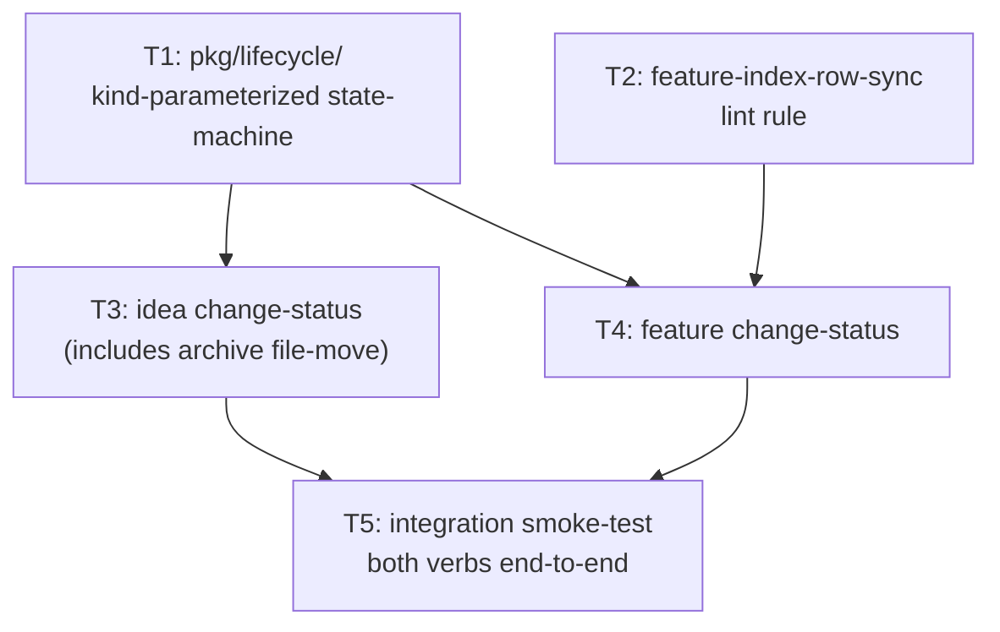

# Plan: Lifecycle Verbs Implementation

**Status:** approved
**Features:**
  - [cli/lifecycle-transitions](../../features/cli/lifecycle-transitions/README.md)
  - [cli/idea/change-status](../../features/cli/idea/change-status/README.md)
  - [cli/feature/change-status](../../features/cli/feature/change-status/README.md)
**Source type:** feature
**Source:** [cli/lifecycle-transitions](../../features/cli/lifecycle-transitions/README.md), [cli/idea/change-status](../../features/cli/idea/change-status/README.md), [cli/feature/change-status](../../features/cli/feature/change-status/README.md)
**Author:** alexander.trakhimenok
**Approver:** alexander.trakhimenok
**Created:** 2026-05-18
**Approved:** 2026-05-18
**Effort:** M
**Impact:** high

## Context

The [lifecycle-verbs-for-idea-and-feature Idea](../../ideas/lifecycle-verbs-for-idea-and-feature.md) and three feature specifications (the [lifecycle-transitions](../../features/cli/lifecycle-transitions/README.md) Meta plus two `change-status` verb features, one per doc kind) are `Approved`. This plan delivers the implementation: a shared `pkg/lifecycle/` package, a new `feature-index-row-sync` lint rule, two CLI subcommands, their tests, and an end-to-end integration check.

The work is structured for **subagent-driven parallelism**. Two foundation tasks (T1 `pkg/lifecycle/`, T2 the new lint rule) are independent and run in parallel. The two verb tasks (T3 `idea change-status`, T4 `feature change-status`) run in parallel after their respective foundations land. A final integration task (T5) runs strictly last. Five tasks total; concurrency peaks at two agents running in parallel during foundations and again during verbs.

The Feature READMEs are the authoritative contracts. Every requirement (`REQ:`) and acceptance criterion (`AC:`) in the two verb specs maps to test coverage. No implementation work begins on a verb until its source REQ set and legal-transition matrix are read end-to-end.

## Acceptance criteria

- Both CLI verbs (`specscore idea change-status <slug> --to=<status>` and `specscore feature change-status <feature_id> --to=<status>`) are runnable end-to-end against a real spec tree.
- `pkg/lifecycle/` exists with a kind-parameterized state-machine: `Transition(kind Kind, from Status, to Status) (err error)` (exact API per Task 1). Used by both verbs.
- `pkg/lint/feature_index.go` exists implementing the `feature-index-row-sync` rule (parity with `pkg/lint/idea_index.go`'s `idea-index-row-sync`); registered with the lint registry; participates in `--fix`.
- Every `AC:` block in both approved verb features is covered by at least one Go unit test (`*_test.go`) that exercises the verb against a tmp-dir spec tree fixture. All tests pass.
- `specscore <kind> change-status --help` renders the kind's legal-transition matrix in a human-readable form (resolves the `change-status --help` Outstanding Question in both verb specs).
- `specscore spec lint --project <tmp-test-repo>` returns `0 violations found` after every happy-path AC, and reports the documented error code (`1`/`2`/`3`/`4`/`10`) for every error AC.
- The build (`go build ./...`) and the full test suite (`go test ./...`) pass on the implementer's branch before merging.
- Existing CLI features (`idea new`, `feature new`, `feature info`, `feature deps`, `feature refs`, `feature tree`, `feature list`, `spec lint`, etc.) are unchanged in behavior. No regression.
- Out of scope for this plan: the [`ai-plugin-specscore`](https://github.com/specscore/ai-plugin-specscore) skill references (deferred per the source Idea); the `feature-index-row-sync` row-sync contract definition in the meta-spec (already added to [features-index](https://github.com/specscore/specscore/blob/main/spec/features/features-index/README.md) in a sibling commit).

## Dependency graph



**Parallelism windows:**
- **Window A** (foundations): T1 and T2 run in parallel. Each is small, focused, independent. ~1–2 hours each.
- **Window B** (verbs): T3 and T4 run in parallel. Both depend on T1; T4 additionally depends on T2. T3 edits `internal/cli/idea.go` and creates `pkg/idea/transitions.go`; T4 edits `internal/cli/feature.go` and creates `pkg/feature/transitions.go`. No file overlap. ~2 hours each.
- **Window C** (integration): T5 runs alone. ~1 hour.

**Subagent dispatch strategy (recommended):**

The implementing session opens a single message dispatching Agent A (T1) and Agent B (T2) in parallel. When BOTH return success, the session opens a single message dispatching Agent C (T3) and Agent D (T4) in parallel. When BOTH return success, the session dispatches Agent E (T5). Total wall-clock: 3 windows ≈ 4–5 hours assuming no surprises.

## Tasks

### 1. Build `pkg/lifecycle/`: kind-parameterized state-machine helpers

Create `pkg/lifecycle/` housing the legal-transition matrix and the atomic-mutation-plus-lint-sync helper that both `change-status` verbs consume. The package MUST be kind-agnostic — Idea, Feature, and any future doc kind plug in their transition tables.

Suggested public API:

```go
package lifecycle

type Kind string
const (
    KindIdea    Kind = "idea"
    KindFeature Kind = "feature"
)

type Status string  // domain-scoped values per kind; validated by transition tables

// Transition validates that `(from, to)` is a legal transition in `kind`'s matrix.
// Returns ErrInvalidTransition wrapped with from, to, and the legal target set
// from the current state on failure.
func Transition(kind Kind, from Status, to Status) error

// LegalTargets returns the legal target statuses for (kind, from), used in error
// messages and (when --help is rendered) in the user-facing matrix display.
func LegalTargets(kind Kind, from Status) []Status

// LegalSources is the inverse: which from-states can transition INTO to.
// Used in error-message construction when target is invalid for the current state.
func LegalSources(kind Kind, to Status) []Status

// LegalStatuses returns every recognized status for a kind. Used to validate
// the --to flag value BEFORE running the state-machine check (so unrecognized
// status names exit 2 InvalidArgs, not 4 InvalidTransition).
func LegalStatuses(kind Kind) []Status

// ParseStatus does case-insensitive parsing; returns the canonical title-case Status
// or false. Used by each verb's flag-parsing layer.
func ParseStatus(kind Kind, raw string) (Status, bool)

// Validate is the primitive: read current status, check transition, return from/to.
// Does not mutate the file.
func Validate(kind Kind, artifactPath string, to Status) (from Status, err error)

// Rewrite mutates the artifact's **Status:** line in place.
// Returns the original line content for rollback purposes.
func Rewrite(artifactPath string, newStatus Status) (originalStatusLine string, err error)

// Rollback restores the artifact to its pre-mutation form.
func Rollback(artifactPath string, originalStatusLine string) error
```

The transition tables hard-code the matrix from each verb's `REQ: legal-transition-matrix`:

| Kind | From → Legal targets |
|---|---|
| idea | `Draft` → {`Approved`, `Archived`} |
| idea | `Under Review` → {`Archived`} |
| idea | `Approved` → {`Archived`} |
| idea | `Implementing` → {`Archived`} |
| idea | `Specified` → {`Archived`} |
| feature | `Draft` → {`Under Review`, `Approved`} |
| feature | `Under Review` → {`Approved`} |
| feature | `Approved` → {`Implementing`} |
| feature | `Implementing` → {`Stable`} |
| feature | `Stable` → {`Deprecated`} |

The package enforces the [lifecycle-transitions#req:not-idempotent](../../features/cli/lifecycle-transitions/README.md#req-not-idempotent) invariant: no `(from, to)` pair where `from == to` is permitted; an init-time panic catches the violation at startup.

`Validate` + `Rewrite` + `Rollback` are separate primitives (not bundled into a single `Apply`) because the Idea kind's `--to=archived` path inserts a file-move step between `Rewrite` and the lint sync, and a single `Apply` would either need a callback hook (clutter) or split into two helpers (this design). Keep the primitives separate; let each verb's command code orchestrate.

**Depends on:** (none)

**Produces:**
- `pkg/lifecycle/lifecycle.go` (or split: `kinds.go`, `transitions.go`, `mutate.go`) — types, transition tables, public API.
- `pkg/lifecycle/lifecycle_test.go` — table-driven tests covering every `(kind, from, to)` triple in the matrix (legal AND illegal targets), `ParseStatus` case-insensitivity, the rollback path, and the not-idempotent init-time panic.

**Acceptance criteria:**
- `go test ./pkg/lifecycle/...` passes.
- `Transition`, `LegalTargets`, `LegalSources`, `LegalStatuses`, `ParseStatus`, `Validate`, `Rewrite`, `Rollback` exposed with stable signatures.
- Init-time `panic` fires if any matrix entry has `from == to` (test asserts the panic by constructing a deliberately bad table in a test-internal helper).
- `Rewrite` + `Rollback` round-trip verified: synthetic file is rewritten from `Draft` to `Approved`, rollback restores byte-identical content.
- No imports from `internal/cli/` or any verb package — `pkg/lifecycle/` is the lowest layer, depends only on the standard library and the existing `pkg/idea` parser (for line-locating the `**Status:**` field).
- Every reachable `(kind, from)` cell in the matrix has at least one test asserting `LegalTargets` returns the correct set, and at least one test asserting an out-of-matrix `to` returns `ErrInvalidTransition`.

### 2. Implement `feature-index-row-sync` lint rule

Create `pkg/lint/feature_index.go` implementing the `feature-index-row-sync` rule per the [features-index#req:index-row-tracks-feature](https://github.com/specscore/specscore/blob/main/spec/features/features-index/README.md#req-index-row-tracks-feature) contract in the meta-spec. The rule's shape mirrors `pkg/lint/idea_index.go`'s `idea-index-row-sync` rule but operates on Features:

- **What it checks:** For every top-level row in `spec/features/README.md`, the `Status` cell MUST match the corresponding feature's `**Status:**` value at `spec/features/<feature_id>/README.md`. Drift is an error-severity violation.
- **What `--fix` does:** Rewrites the drifted `Status` cell in the index row to match the feature README. `Feature` link and `Description` cells are NOT rewritten (hand-maintained per the meta-spec contract).
- **Scope:** Top-level features only (sub-features are not in the features-index per [features-index#req:top-level-only](https://github.com/specscore/specscore/blob/main/spec/features/features-index/README.md#req-top-level-only)).

Register the rule with the lint registry so it participates in the default `spec lint` run and the `--fix` autofix path.

**Depends on:** (none) — independent of T1 and runs in parallel.

**Produces:**
- `pkg/lint/feature_index.go` — rule implementation + fix helper.
- `pkg/lint/feature_index_test.go` — tests for drift detection AND `--fix` row rewrite.
- Registry edit in `pkg/lint/` wherever rules are wired up (cross-check `pkg/lint/idea_index.go` for the pattern).

**Acceptance criteria:**
- `go test ./pkg/lint/...` passes.
- Drift case: synthetic spec tree with `spec/features/auth/README.md` declaring `**Status:** Approved` and `spec/features/README.md` row for `auth` showing `Draft`. `specscore spec lint` reports `feature-index-row-sync` violation. `specscore spec lint --fix` rewrites the row. Re-running lint reports 0 violations.
- Clean case: synthetic spec tree where every row matches its feature README. Lint reports 0 violations, `--fix` is a no-op.
- The rule fires only for top-level features. Sub-features are not checked.

### 3. Implement `specscore idea change-status`

Add a `change-status` subcommand under `specscore idea`, consuming `pkg/lifecycle/`'s primitives. Wires into `internal/cli/idea.go`; kind-specific logic (archive file move, archive collision check) lives in `pkg/idea/transitions.go` (new file).

Command flow:
1. Parse `<slug>` (positional) + `--to=<status>` (required flag). Unrecognized `--to` value → exit `2`.
2. Resolve `<slug>` to `spec/ideas/<slug>.md` (active path only; excludes `archived/`). Missing → exit `3`.
3. `lifecycle.Validate(KindIdea, path, to)` → from-status or `ErrInvalidTransition` (exit `4`).
4. `lifecycle.Rewrite(path, to)` → captures original line for rollback.
5. If `to == Archived`: check collision at `spec/ideas/archived/<slug>.md` (collision → rollback + exit `1`); `os.Rename` source to archived dir (mkdir-p first; failure → rollback + exit `10`).
6. Invoke `spec lint --fix`. Failure → rollback (restore status line AND, if archived, move file back to active) + exit `10`.
7. On success, print `<slug>: <from> → <to>` to stdout. Exit `0`.

**Depends on:** Task 1 (pkg/lifecycle/)

**Produces:**
- `internal/cli/idea.go` — new `change-status` subcommand registration. Alphabetically positioned before `new` (cobra `--help` output stays sorted).
- `pkg/idea/transitions.go` — `ChangeStatus(...)` function called by the cobra handler. Handles the archive-specific orchestration (collision check, file move, extended rollback).
- `pkg/idea/transitions_test.go` — table-driven tests for every AC in [`cli/idea/change-status/README.md`](../../features/cli/idea/change-status/README.md) (11 ACs).
- Updates to `internal/cli/idea_test.go` for CLI-level argument parsing.

**Acceptance criteria:**
- `go test ./internal/cli/... ./pkg/idea/...` passes.
- Every AC in `cli/idea/change-status/README.md` exercised by a test:
  - `draft-to-approved-happy-path`, `archive-from-approved-happy-path`, `case-insensitive-to-flag`, `illegal-target-rejected`, `already-approved-rejected`, `unrecognized-to-value-rejected`, `archive-collision`, `missing-slug-rejected`, `missing-to-flag-rejected`, `slug-not-found`, `lint-failure-rolls-back` (11 ACs).
- `specscore idea change-status foo --to=approved` and `--to=archived` both work against a tmp spec tree, with documented stdout/stderr.
- `specscore idea change-status --help` renders the Idea legal-transition matrix as a human-readable table.
- No edits to `internal/cli/feature.go` — Task 4 owns that file.

### 4. Implement `specscore feature change-status`

Add a `change-status` subcommand under `specscore feature`, consuming `pkg/lifecycle/`'s primitives. Wires into `internal/cli/feature.go`; kind-specific logic (feature-id resolution including slash-bearing nested ids) lives in `pkg/feature/transitions.go` (new file).

Command flow:
1. Parse `<feature_id>` (positional) + `--to=<status>` (required flag). Unrecognized `--to` value → exit `2`.
2. Resolve `<feature_id>` to `spec/features/<feature_id>/README.md`. Slash-bearing ids resolve as a path within `spec/features/`. Missing → exit `3`.
3. `lifecycle.Validate(KindFeature, path, to)` → from-status or `ErrInvalidTransition` (exit `4`).
4. `lifecycle.Rewrite(path, to)`.
5. Invoke `spec lint --fix`. Failure → rollback + exit `10`.
6. On success, print `<feature_id>: <from> → <to>` to stdout. Exit `0`.

No file relocation, no collision checks — feature transitions are pure status rewrites.

**Depends on:** Task 1 (pkg/lifecycle/) AND Task 2 (feature-index-row-sync lint rule)

**Produces:**
- `internal/cli/feature.go` — new `change-status` subcommand registration. Alphabetically positioned (before `deps`, after the parent's other entries in their existing order).
- `pkg/feature/transitions.go` — `ChangeStatus(...)` function called by the cobra handler; shared `resolveFeatureID(...)` helper for slash-bearing nested ids.
- `pkg/feature/transitions_test.go` — table-driven tests for every AC in [`cli/feature/change-status/README.md`](../../features/cli/feature/change-status/README.md) (~14 ACs).
- Updates to existing `internal/cli/feature_test.go` for new subcommand registration.

**Acceptance criteria:**
- `go test ./internal/cli/... ./pkg/feature/...` passes.
- Every AC in the verb spec is exercised by a test (14 ACs covering 5 happy-path transitions + nested-id + case-insensitivity + 6 error paths).
- The nested-feature-id AC (`feature change-status cli/idea/change-status --to=approved` resolves correctly) passes.
- `specscore feature change-status --help` renders the Feature legal-transition matrix as a human-readable table.
- No edits to `internal/cli/idea.go` — Task 3 owns that file.

### 5. End-to-end integration smoke-test

Author a single integration test that exercises **both verbs across the full lifecycle** against a tmp spec tree. Final acceptance gate: if the test passes, the plan is done.

Suggested test flow:

1. `specscore init` a tmp project.
2. `specscore idea new foo` — creates `spec/ideas/foo.md` at `Status: Draft`.
3. `specscore idea change-status foo --to=approved` — exit `0`, file at `Approved`, index synced.
4. `specscore idea change-status foo --to=archived` — exit `0`, file moved to `archived/`, both indexes synced.
5. `specscore feature new bar --status Draft` (existing functionality) — creates `spec/features/bar/README.md`.
6. `specscore feature change-status bar --to="under review"` — exit `0`, status `Under Review`, index synced.
7. `specscore feature change-status bar --to=approved` — exit `0`, status `Approved`, index synced.
8. `specscore feature change-status bar --to=implementing` — exit `0`, status `Implementing`, index synced.
9. `specscore feature change-status bar --to=stable` — exit `0`, status `Stable`, index synced.
10. `specscore feature change-status bar --to=deprecated` — exit `0`, status `Deprecated`, index synced.
11. `specscore spec lint --project <tmpdir>` — final state: 0 violations.

Plus integration-level failure-mode coverage: re-run each transition on the target state, assert exit `4` and unchanged on-disk state; attempt a `Draft → Stable` direct jump on a Feature, assert exit `4`.

**Depends on:** Tasks 3 and 4

**Produces:**
- `internal/cli/lifecycle_integration_test.go` (or similar) — single end-to-end test.
- Any small fixtures the test needs.

**Acceptance criteria:**
- `go test ./internal/cli/... -run LifecycleIntegration` passes.
- The test takes < 10 seconds on a developer laptop.
- `specscore spec lint --project <tmp-test-repo>` returns `0 violations found` at every documented happy-state checkpoint.
- `specscore --help` lists both new subcommands under their parent groups.

## Subagent dispatch instructions

For the implementer driving this plan:

**Window A (parallel — single message, two Agent tool calls):**
- Agent A: Task 1 (`pkg/lifecycle/`). Prompt hands over: the lifecycle-transitions Feature README, the legal-transition matrix from this plan's Task 1, and the suggested API sketch. Tell the agent to test exhaustively and not invent flags or behaviors beyond what the Meta REQs declare.
- Agent B: Task 2 (`feature-index-row-sync` lint rule). Prompt hands over: `pkg/lint/idea_index.go` as the canonical pattern, the meta-spec [features-index#req:index-row-tracks-feature](https://github.com/specscore/specscore/blob/main/spec/features/features-index/README.md#req-index-row-tracks-feature) REQ, and the registration call site to identify by reading.

Wait for both to return success. If either fails, fix and re-dispatch only the failing agent.

**Window B (parallel — single message, two Agent tool calls):**
- Agent C: Task 3 (idea `change-status`). Prompt hands over: `cli/idea/change-status/README.md` and notes that `pkg/lifecycle/` is ready. Tell the agent to write tests for every AC (11 total) before writing the implementation; pay special attention to the archive collision + rollback paths.
- Agent D: Task 4 (feature `change-status`). Prompt hands over: `cli/feature/change-status/README.md` and notes that BOTH `pkg/lifecycle/` and `feature-index-row-sync` are ready. Tell the agent to write a table-driven test covering all ~14 ACs and the slash-bearing-id AC.

Wait for both to return success.

**Window C (sequential):**
- Agent E: Task 5 (integration smoke-test). Solo agent; no parallelism. Prompt hands over the test flow above. Instruct the agent to verify final state via `specscore spec lint --project <tmpdir>`.

After Agent E returns success, the human implementer (or `claude` directly) runs the full suite (`go test ./...` + `go build ./...`) one more time before merge.

## Risks and open decisions

- **`pkg/lifecycle/` decomposition (Validate + Rewrite + Rollback as primitives vs single `Apply` helper).** Task 1's suggested API exposes separate primitives so `idea change-status --to=archived` can insert the file-move between `Rewrite` and the lint sync. Agent A SHOULD design the split deliberately; if Agent A picks a different decomposition that still satisfies every verb's contract, that's acceptable.
- **`feature-index-row-sync` already exists assumption.** This plan assumes the rule does not exist; pre-task check: `grep -r "feature-index-row-sync" pkg/lint/`.
- **`specscore feature new --status` flag.** Task 5's integration test invokes `feature new --status Draft`. The existing `feature new` already accepts `--status` per `internal/cli/feature.go:669` (verified during the source Idea phase). No change needed.
- **`change-status --help` matrix rendering format.** Both verb specs name this as an Outstanding Question with lean toward "render it." Agents C and D MUST render it; the form (table vs bullet list vs ASCII tree) is the implementer's call as long as it's readable.
- **Test fixture noise.** Each verb's test writes to a `t.TempDir()`. Agents C and D MUST keep test state local to each test function — no `init()` or package-level mutable state.
- **Cobra command ordering.** New subcommands MUST be registered so `--help` output stays alphabetically sorted. Agents C and D MUST verify the existing ordering convention in `internal/cli/idea.go` and `internal/cli/feature.go` before inserting.

## Snapshots

| Date | Git Hash | Action | Comment |
|---|---|---|---|

## Open Questions

- Should the `ai-plugin-specscore` skill references (one per kind) land in a follow-on plan immediately after this one merges, or be batched until multiple lifecycle features ship? Current position: separate follow-on plan; the skills wrap the verbs but don't change them.
- Should the `pkg/lifecycle/` package be promoted to a public Go module path for external consumers (e.g., Synchestra calling into it directly), or stay internal until a real consumer asks? Current position: internal.

---
*This document follows the https://specscore.md/plan-specification*
