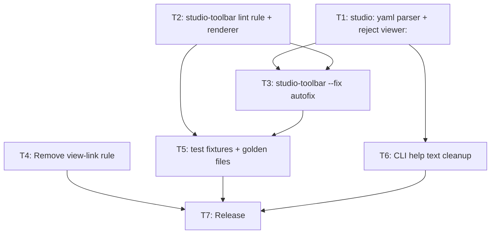

# Plan: Studio Toolbar — CLI Implementation

**Status:** draft
**Features:**
  - [studio-toolbar (specscore repo)](https://github.com/specscore/specscore/blob/main/spec/features/studio-toolbar/README.md)
  - [repo-config (specscore repo)](https://github.com/specscore/specscore/blob/main/spec/features/repo-config/README.md)
**Source type:** feature
**Source:** [studio-toolbar (specscore repo)](https://github.com/specscore/specscore/blob/main/spec/features/studio-toolbar/README.md)
**Author:** alexander.trakhimenok
**Created:** 2026-05-19
**Effort:** M
**Impact:** high

## Context

The [studio-toolbar Feature](https://github.com/specscore/specscore/blob/main/spec/features/studio-toolbar/README.md) is `Approved` in the `specscore` spec repository. It specifies a four-item toolbar (Explore | Edit | Ask question | Request change) replacing the legacy `> [View in SpecStudio](url) — graph, discussions, approvals` line at file position 3 of every feature README. The Feature also renames the `viewer:` yaml block to `studio:`, migrates the default URL from `https://specstudio.synchestra.io/` to `https://specscore.studio/`, and introduces a new path-style grammar `{studio.url}/app/p/{host}/{org}/{repo}/{artifact_path}?op={verb}` where `{verb}` is in the closed set `{explore, edit, ask, request-change}`. Brand attribution is a clickable link wrapping `studio.name` with the segment after the last `.` rendered bold.

This plan delivers the CLI-side implementation in `specscore-cli`. The sibling spec-side plan in [`specscore`](https://github.com/specscore/specscore/blob/main/spec/plans/studio-toolbar/README.md) handles the spec revisions, `specscore.yaml` hand-edit, and final `--fix` invocation against the spec tree.

The Feature is pre-v1; the `viewer:` → `studio:` rename is a **hard break with no backcompat**. The release that ships these changes is a breaking version bump. There are no external users yet, so no deprecation window is required.

Implementation is structured for **subagent-driven parallelism**:

- **T1** (config parser) and **T2** (new lint rule core) are independent and can run in parallel.
- **T3** (autofix) depends on T1 and T2 — it consumes the parser and the rule's canonical-form renderer.
- **T4** (remove `view-link`) is independent and can run any time before T7.
- **T5** (test fixtures) depends on T2 and T3 — fixtures verify both rule and autofix.
- **T6** (CLI help text) depends on T1.
- **T7** (release) runs strictly last after every other task passes.

## Acceptance criteria

- The config parser accepts a `studio:` top-level block with `name` (string) and `url` (string ending in `/`) fields. Partial mappings (`studio: { name: X }` without `url`, or vice versa) are a hard parse error. `studio: null` is accepted as the all-or-nothing opt-out. Omitted `studio:` block yields defaults `name = "SpecScore.Studio"`, `url = "https://specscore.studio/"`. The parser MUST reject `viewer:` blocks (in any form — mapping, null, bare key) with a hard error whose message directs the user to rename to `studio:`.
- A new lint rule named `studio-toolbar` is registered. It validates that the line at file position 3 of every `spec/features/*/README.md` matches the canonical byte form per REQ `toolbar-line-shape` in the source Feature, given the project's resolved `studio` config and the feature's directory path. Any byte deviation (wrong separator, wrong label, missing item, wrong host, missing `?op=`, etc.) produces a hard `error`-severity violation.
- The canonical-form renderer (used by both the lint rule and the autofix) strips exactly one trailing `/` from `studio.url` before joining with the path grammar, produces the brand attribution per REQs `brand-attribution-rendering` / `brand-attribution-no-dot` / `brand-attribution-multi-dot`, and never emits UTM parameters or `@branch`/`?ref=` suffixes.
- `specscore spec lint --fix` rewrites non-conforming toolbar lines (legacy `> [View in ...]` form, any drifted toolbar, missing toolbar entirely when `studio:` is not null) to the canonical form. The fix MUST refuse to run while `viewer:` is still present in `specscore.yaml`, emitting a hard error directing the user to rename the block first. The fix MUST NOT touch any line of any README other than file position 3.
- The legacy `view-link` lint rule is removed from the rule registry. Invocations like `--ignore view-link` or `--rules view-link` produce a "rule not found" error naming `studio-toolbar` as the replacement.
- The default `studio.url` value in the parser is `https://specscore.studio/` (not the legacy `https://specstudio.synchestra.io/`).
- Every `AC:` block in the [studio-toolbar Feature](https://github.com/specscore/specscore/blob/main/spec/features/studio-toolbar/README.md) (14 ACs covering 18 REQs) is exercised by at least one Go test (`*_test.go`) that runs against a tmp-dir spec tree fixture. All tests pass.
- `specscore <kind> --help` for relevant subcommands does not contain stale references to `viewer:` or the legacy URL host.
- `go build ./...` and `go test ./...` pass on the implementer's branch before tagging the release.
- Release artifacts are published to all configured channels (curl install via `specscore.md`, Homebrew tap, Scoop bucket, WinGet) at the new version. The version is a **breaking bump** (e.g., `0.17.0` → `0.18.0` or `0.17.0` → `1.0.0`-style — owner decides) since the `viewer:` parse rejection is a hard break.

## Dependency graph

T1 and T2 are independent and can run in parallel. T4 is also independent of T1-T3 (pure removal). T3, T5, T6 sequence after their predecessors. T7 is gated on all foundation work being green.

## Tasks

### 1. `studio:` yaml parser; reject `viewer:`

Modify the config parser (likely `internal/config/` or wherever `repo-config` is parsed today) to:

- Add a top-level `Studio` struct field on the in-memory config: `Name string`, `URL string`, plus a `set` boolean and a `null` boolean to distinguish "omitted" / "explicit values" / "explicit null".
- Parse the `studio:` yaml block:
  - **Omitted**: `set = false`. The default values `Name = "SpecScore.Studio"`, `URL = "https://specscore.studio/"` are applied at access time.
  - **`studio: null`** (any of `null`, `~`, empty value): `null = true`, `set = true`. Both `Name` and `URL` are zero-valued; downstream code reads `null` and suppresses the toolbar.
  - **Mapping with both `name` and `url`**: `set = true`, `null = false`, both fields populated from yaml.
  - **Partial mapping** (only one of `name` / `url`): hard parse error citing REQ `studio-explicit-values`.
- Validate `studio.url`: MUST end with exactly one `/` character (per the new REQ `studio-url-trailing-slash` in the revised `repo-config` Feature). Hard error otherwise. This validation is owned by `repo-config` semantically; the parser enforces it.
- Reject `viewer:` blocks in any form:
  - Detect the presence of the `viewer:` key in the parsed yaml (BEFORE further parsing — if `viewer:` is present, fail fast).
  - Emit a hard parse error with a clear migration message: `viewer: block is no longer supported. Rename to studio: in specscore.yaml. See https://specscore.md/repo-config-specification.` (or similar URL pointing at the canonical doc).
- Wire the new default values: `Name = "SpecScore.Studio"`, `URL = "https://specscore.studio/"`. Remove any constant references to `SpecStudio` / `specstudio.synchestra.io/` in default value definitions.

Add unit tests for each case: omitted, null, full mapping, partial mapping (error), `viewer:` present (error), invalid `studio.url` without trailing slash (error). Ensure existing tests that previously asserted `viewer:` parse outcomes are updated or removed.

### 2. `studio-toolbar` lint rule and canonical renderer

Create a new lint rule named `studio-toolbar` in the rule registry (likely `pkg/lint/studio_toolbar.go` or similar, mirroring whatever convention exists for `idea-index-row-sync` / `idea-sync-lint-strict` / etc.). The rule:

- Registers with the lint engine; participates in `specscore spec lint` and is autofixable (`--fix` support flag = true).
- Operates on every `spec/features/*/README.md` file found in the project.
- Reads the resolved `studio` config:
  - If `studio.null == true`: emit no violation for this file (toolbar opt-out is global).
  - Otherwise: compute the expected toolbar line and compare byte-for-byte against line 3 of the file.
- The expected line is computed by a pure renderer function `RenderToolbar(cfg StudioConfig, artifactPath string) string`. This function is shared between the lint rule and the autofix (T3). It produces the canonical form per REQ `toolbar-line-shape`:
  - `> ` prefix (blockquote + single space)
  - Brand attribution `[{name-prefix}{**name-product**}]({url-stripped}):` where:
    - `name-product` is the substring of `studio.name` after the LAST `.`; if no `.`, the entire name is `name-product` with NO bold wrapping (per REQ `brand-attribution-no-dot`).
    - `name-prefix` is everything before and including the last `.`; empty string if no `.`.
    - `url-stripped` is `studio.url` minus its trailing `/`.
  - Four toolbar items in order: `[Explore]({url})`, `[Edit]({url})`, `[Ask question]({url})`, `[Request change]({url})`.
  - Each URL: `{url-stripped}/app/p/{host}/{org}/{repo}/{artifact-path}?op={verb}` where `artifact-path` is the feature directory path from repo root (e.g., `spec/features/repo-config`), NOT including `/README.md`. Per REQ `url-grammar-path`, only RFC 3986-mandatory percent-encoded characters are encoded; `-`, `_`, `.`, `/` are preserved literally.
  - Separator: ` | ` (space-pipe-space) between brand-and-first-item and between every adjacent pair of items.
  - Trailing ` |` (space-pipe).
  - Line ends with a single LF, no trailing whitespace.
- Violation detection:
  - **Missing line 3**: file does not have a line 3 (file too short) — violation with category "missing".
  - **Wrong line content**: line 3 exists but is not byte-equal to the expected line — violation with category "drift", message includes the specific deviation (diff against expected).
- Severity is `error` for all violations.

Add unit tests against the renderer for: default config, custom config with single-dot name, custom config with multi-dot name, custom config with no-dot name, trailing-slash strip behavior. Tests that exercise the rule directly (line-3 byte match against rendered form) cover the rule's validation logic.

### 3. `studio-toolbar` `--fix` autofix

Extend the rule from T2 with autofix capability:

- The autofix function reads the same `studio` config + artifact path inputs as the rule.
- **Precondition guard**: if the parser (T1) reported a `viewer:` block error, the autofix MUST NOT run. The fix engine MUST surface the parse error and exit non-zero. (This is naturally enforced if config parsing is the first step of every CLI invocation; verify the existing fix flow does so.)
- **Action**: replace line 3 of every targeted feature README with the canonical rendered line. If the file has fewer than 3 lines, append a blank line 2 (if needed) and the toolbar at line 3. If the file has a line 3 that is non-conforming (legacy `> [View in ...]` form, drifted toolbar, blank line, or anything else), replace it.
- **Opt-out behavior**: if `studio.null == true`, the autofix removes line 3 from every feature README (if it is currently a toolbar line) and shifts subsequent lines up. Lint MUST NOT report a violation in this case.
- The autofix MUST NOT modify any other line of the README.

Test fixtures (T5) cover: legacy-line rewrite, drifted-toolbar rewrite, missing-toolbar insert, opt-out strip, viewer-present block.

### 4. Remove `view-link` rule

Delete the implementation file for the legacy `view-link` rule (it has been removed by `studio-toolbar` — there is no co-existence). Update the rule registry to:

- No longer register `view-link`.
- Detect references to `view-link` in CLI flag values (`--ignore=view-link`, `--rules=view-link`) and emit a clear error: `unknown rule "view-link" (removed in this release — use "studio-toolbar" instead)`.

Update tests that exercised `view-link`: either rewrite to `studio-toolbar` or delete if the test was specifically about the legacy rule's behavior.

### 5. Test fixtures and golden files

For each AC in the [studio-toolbar Feature](https://github.com/specscore/specscore/blob/main/spec/features/studio-toolbar/README.md), create or update a Go test that exercises the AC's `Given / When / Then` against a tmp-dir fixture spec tree:

- `AC: toolbar-rendered-with-defaults` — fixture with no `studio:` block, a feature directory, no toolbar at line 3; assert that `--fix` produces the exact expected line.
- `AC: brand-attribution-bolds-last-segment` — fixture with `studio.name = "Acme.Internal.Studio"`; assert the rendered prefix.
- `AC: brand-attribution-no-dot-no-bold` — fixture with `studio.name = "AcmeSpecs"`; assert no `**` in the prefix.
- `AC: url-grammar-strips-trailing-slash` — fixture with `studio.url = "https://x.example/"`; assert no `//` in any rendered URL.
- `AC: opt-out-suppresses-toolbar` — fixture with `studio: null`; assert lint emits no violations for features lacking a toolbar.
- `AC: lint-errors-on-byte-drift` — fixtures with each of: missing space around `|`, lowercase `explore`, missing trailing pipe; each must produce exactly one `studio-toolbar error`.
- `AC: viewer-block-is-hard-error` — fixture with `viewer:` block in `specscore.yaml`; assert parse error before lint reaches features.
- `AC: autofix-rewrites-legacy-line` — fixture with legacy `> [View in SpecStudio](...) — graph, discussions, approvals` at line 3; assert `--fix` replaces only line 3 with canonical toolbar.
- `AC: autofix-blocked-when-viewer-still-present` — fixture with `viewer:` block + non-conforming toolbar; assert `--fix` modifies no files and emits a hard error.
- `AC: view-link-rule-removed` — invoke `specscore spec lint --ignore view-link`; assert "rule not found" error citing `studio-toolbar`.
- `AC: opt-out-strips-existing-toolbar` — fixture with `studio: null` and a pre-existing canonical toolbar at line 3; assert `--fix` removes only line 3.
- `AC: no-section-or-req-scope-tokens` — fixture with toolbar containing `&section=behavior` in any URL; assert lint error citing `toolbar-file-scope`.
- `AC: no-utm-parameters` — fixture with toolbar URL containing `utm_source=foo`; assert lint error citing `url-grammar-no-utm`.
- `AC: no-branch-or-tag-suffix` — fixture with toolbar URL containing `@main` or `?ref=tag`; assert lint error citing `url-grammar-no-branch-tag`.

All 14 tests MUST pass. `go test ./...` MUST be green before T7.

### 6. CLI help text cleanup

Audit help text across `specscore --help`, `specscore spec lint --help`, error messages, and any printed documentation in `cmd/`. Replace all stale references:

- `viewer:` → `studio:`
- `View in SpecStudio` / "View in" verbiage → "studio toolbar" or analogous
- `specstudio.synchestra.io` → `specscore.studio` (where it appears as an example or default)

Grep is sufficient: `grep -r "viewer\|specstudio\.synchestra\.io" cmd/ internal/ pkg/`. Hand-update each match.

### 7. Release

Once T1-T6 are green:

- Decide the version bump. This is a breaking change (rejecting `viewer:`). Minor bump (`0.17.0` → `0.18.0`) is defensible since the project is pre-v1; major bump (`0.x` → `1.0.0`) is also defensible if shipping this signals stability. Owner decides.
- Write the changelog entry: highlight the `viewer:` removal, the new `studio:` block defaults, the toolbar form, the `studio-toolbar` lint rule, the `view-link` removal, and the new default `studio.url`. Include the rename migration command (`specscore spec lint --fix` after hand-editing `specscore.yaml`).
- Tag the release; the existing build pipeline (Homebrew tap, Scoop bucket, WinGet, curl install) publishes artifacts.
- Notify the sibling [specscore plan](https://github.com/specscore/specscore/blob/main/spec/plans/studio-toolbar/README.md) (its T3 is the explicit wait state).

## Open Questions

- The exact location of the new rule implementation file is left to the implementer's call based on existing `pkg/lint/` / `internal/lint/` conventions in this repo. The pattern from the `lifecycle-verbs-implementation` plan (`pkg/lint/feature_index.go` style) is a reasonable model.
- The renderer function signature `RenderToolbar(cfg StudioConfig, artifactPath string) string` is a suggested shape; implementers may prefer to take a `*ProjectConfig` plus a `*FeatureRef` if those exist. The constraint is that the renderer and the lint validator MUST share one implementation so they cannot drift.

---
*This document follows the https://specscore.md/plan-specification*
